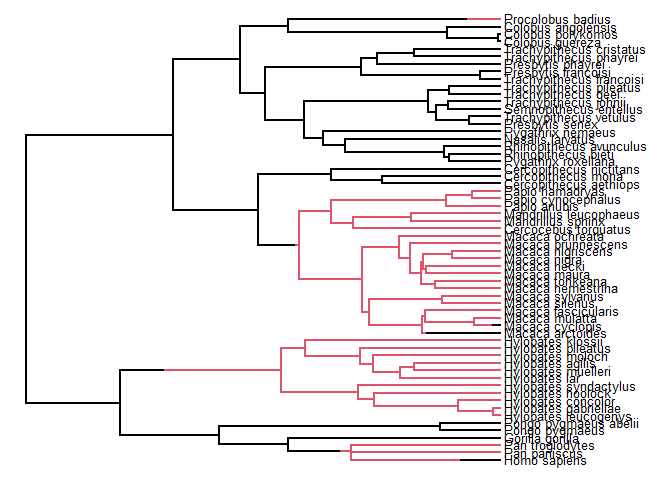

Correlations Exercise
================
Jackson Turner
4/7/2022

## Initial

``` r
library(geiger)
```

    ## Loading required package: ape

``` r
library(corHMM)
```

    ## Loading required package: nloptr

    ## Loading required package: GenSA

``` r
library(ape)
tree.primates <- read.tree(text="((((Homo:0.21,Pongo:0.21):0.28,Macaca:0.49):0.13,Ateles:0.62):0.38,Galago:1.00);") #using examples from ape ?pic
X <- c(4.09434, 3.61092, 2.37024, 2.02815, -1.46968)
Y <- c(4.74493, 3.33220, 3.36730, 2.89037, 2.30259)
names(X) <- names(Y) <- c("Homo", "Pongo", "Macaca", "Ateles", "Galago")
pic.X <- pic(X, tree.primates)
pic.Y <- pic(Y, tree.primates)

require("corHMM")
data(primates)
ls()
```

    ## [1] "pic.X"         "pic.Y"         "primates"      "tree.primates"
    ## [5] "X"             "Y"

``` r
print(primates)
```

    ## $tree
    ## 
    ## Phylogenetic tree with 60 tips and 58 internal nodes.
    ## 
    ## Tip labels:
    ##   Homo_sapiens, Pan_paniscus, Pan_troglodytes, Gorilla_gorilla, Pongo_pygmaeus, Pongo_pygmaeus_abelii, ...
    ## 
    ## Rooted; includes branch lengths.
    ## 
    ## $trait
    ##                    Genus_sp T1 T2
    ## 1      Cercocebus_torquatus  1  1
    ## 2    Cercopithecus_aethiops  0  1
    ## 3        Cercopithecus_mona  0  0
    ## 4   Cercopithecus_nictitans  0  0
    ## 5        Colobus_angolensis  0  1
    ## 6           Colobus_guereza  0  0
    ## 7         Colobus_polykomos  0  1
    ## 8           Gorilla_gorilla  0  0
    ## 9              Homo_sapiens  0  0
    ## 10         Hylobates_agilis  0  0
    ## 11       Hylobates_concolor  0  0
    ## 12     Hylobates_gabriellae  0  0
    ## 13        Hylobates_hoolock  0  0
    ## 14        Hylobates_klossii  0  0
    ## 15            Hylobates_lar  0  0
    ## 16     Hylobates_leucogenys  0  0
    ## 17         Hylobates_moloch  0  0
    ## 18       Hylobates_muelleri  0  0
    ## 19       Hylobates_pileatus  0  0
    ## 20    Hylobates_syndactylus  0  0
    ## 21       Macaca_brunnescens  1  1
    ## 22          Macaca_cyclopis  0  1
    ## 23      Macaca_fascicularis  1  1
    ## 24             Macaca_hecki  1  1
    ## 25             Macaca_maura  1  1
    ## 26           Macaca_mulatta  1  1
    ## 27        Macaca_nemestrina  1  1
    ## 28             Macaca_nigra  1  1
    ## 29        Macaca_nigriscens  1  1
    ## 30          Macaca_ochreata  1  1
    ## 31           Macaca_silenus  1  1
    ## 32          Macaca_sylvanus  1  1
    ## 33          Macaca_tonkeana  1  1
    ## 34   Mandrillus_leucophaeus  1  1
    ## 35        Mandrillus_sphinx  1  1
    ## 36         Nasalis_larvatus  0  0
    ## 37             Pan_paniscus  1  1
    ## 38          Pan_troglodytes  1  1
    ## 39             Papio_anubis  1  1
    ## 40       Papio_cynocephalus  1  1
    ## 41          Papio_hamadryas  1  1
    ## 42           Pongo_pygmaeus  0  0
    ## 43    Pongo_pygmaeus_abelii  0  0
    ## 44      Presbytis_francoisi  0  0
    ## 45        Presbytis_phayrei  0  0
    ## 46          Presbytis_senex  0  0
    ## 47        Procolobus_badius  1  1
    ## 48        Pygathrix_nemaeus  0  1
    ## 49      Pygathrix_roxellana  0  1
    ## 50  Rhinopithecus_avunculus  0  1
    ## 51      Rhinopithecus_bieti  0  1
    ## 52   Semnopithecus_entellus  0  1
    ## 53 Trachypithecus_cristatus  0  0
    ## 54 Trachypithecus_francoisi  0  0
    ## 55      Trachypithecus_geei  0  0
    ## 56    Trachypithecus_johnii  0  0
    ## 57   Trachypithecus_phayrei  0  0
    ## 58  Trachypithecus_pileatus  0  0
    ## 59   Trachypithecus_vetulus  0  0
    ## 60         Macaca_arctoides  0  1

``` r
require(phytools)
```

    ## Loading required package: phytools

    ## Loading required package: maps

``` r
primates$trait[which(grepl("Hylobates",primates$trait[,1])),2]<-1

trait1<-primates$trait[,2]
names(trait1)<-primates$trait[,1]
primates$tree <- ape::multi2di(primates$tree)
plotSimmap(make.simmap(primates$tree, trait1), pts=FALSE, fsize=0.8)
```

    ## make.simmap is sampling character histories conditioned on
    ## the transition matrix
    ## 
    ## Q =
    ##             0           1
    ## 0 -0.01076402  0.01076402
    ## 1  0.01076402 -0.01076402
    ## (estimated using likelihood);
    ## and (mean) root node prior probabilities
    ## pi =
    ##   0   1 
    ## 0.5 0.5

    ## Done.

    ## no colors provided. using the following legend:
    ##         0         1 
    ##   "black" "#DF536B"

<!-- -->

``` r
rate.mat.er<-corHMM:::rate.mat.maker(rate.cat=1, hrm=FALSE, ntraits=1, nstates=2, model="ER")
print(rate.mat.er)
```

    ##    1  2
    ## 1 NA  1
    ## 2  1 NA

``` r
pp.er<-corHMM(primates$tree,primates$trait[,c(1,2)],rate.cat=1,rate.mat=rate.mat.er,node.states="marginal")
```

    ## State distribution in data:
    ## States:  1   2   
    ## Counts:  28  32  
    ## Beginning thorough optimization search -- performing 0 random restarts 
    ## Finished. Inferring ancestral states using marginal reconstruction.

``` r
print(pp.er)
```

    ## 
    ## Fit
    ##       -lnL     AIC     AICc Rate.cat ntax
    ##  -23.41535 48.8307 48.89967        1   60
    ## 
    ## Legend
    ##   1   2 
    ## "0" "1" 
    ## 
    ## Rates
    ##           (1,R1)    (2,R1)
    ## (1,R1)        NA 0.0107655
    ## (2,R1) 0.0107655        NA
    ## 
    ## Arrived at a reliable solution

``` r
rate.mat.ard<-corHMM:::rate.mat.maker(rate.cat=1, hrm=FALSE, ntraits=1, nstates=2, model="ARD")
print(rate.mat.ard)
```

    ##    1  2
    ## 1 NA  2
    ## 2  1 NA

``` r
pp.ard<-corHMM(primates$tree,primates$trait[,c(1,2)],rate.cat=1,rate.mat=rate.mat.ard,node.states="marginal")
```

    ## State distribution in data:
    ## States:  1   2   
    ## Counts:  28  32  
    ## Beginning thorough optimization search -- performing 0 random restarts 
    ## Finished. Inferring ancestral states using marginal reconstruction.

``` r
print(pp.ard)
```

    ## 
    ## Fit
    ##      -lnL     AIC     AICc Rate.cat ntax
    ##  -23.4031 50.8062 51.01673        1   60
    ## 
    ## Legend
    ##   1   2 
    ## "0" "1" 
    ## 
    ## Rates
    ##           (1,R1)     (2,R1)
    ## (1,R1)        NA 0.01012567
    ## (2,R1) 0.0114391         NA
    ## 
    ## Arrived at a reliable solution

``` r
rate.mat.er.4state<-corHMM:::rate.mat.maker(rate.cat=1, hrm=FALSE, ntraits=1, nstates=4, model="ER")
print(rate.mat.er.4state)
```

    ##    1  2  3  4
    ## 1 NA  1  1  1
    ## 2  1 NA  1  1
    ## 3  1  1 NA  1
    ## 4  1  1  1 NA

``` r
rate.mat.ard.4state<-corHMM:::rate.mat.maker(rate.cat=1, hrm=FALSE, ntraits=1, nstates=4, model="ARD")
print(rate.mat.ard.4state)
```

    ##    1  2  3  4
    ## 1 NA  4  7 10
    ## 2  1 NA  8 11
    ## 3  2  5 NA 12
    ## 4  3  6  9 NA

``` r
rate.mat.gtr.4state<-rate.mat.ard.4state
rate.mat.gtr.4state<-corHMM:::rate.par.eq(rate.mat.gtr.4state, c(1,4))
rate.mat.gtr.4state<-corHMM:::rate.par.eq(rate.mat.gtr.4state, c(2,6))
rate.mat.gtr.4state<-corHMM:::rate.par.eq(rate.mat.gtr.4state, c(3,8))
rate.mat.gtr.4state<-corHMM:::rate.par.eq(rate.mat.gtr.4state, c(4,6))
rate.mat.gtr.4state<-corHMM:::rate.par.eq(rate.mat.gtr.4state, c(5,7))
rate.mat.gtr.4state<-corHMM:::rate.par.eq(rate.mat.gtr.4state, c(6,7))
print(rate.mat.gtr.4state)
```

    ##    1  2  3  4
    ## 1 NA  1  2  3
    ## 2  1 NA  4  5
    ## 3  2  4 NA  6
    ## 4  3  5  6 NA

``` r
fourstate.trait<-rep(NA,Ntip(primates$tree))
for(i in sequence(Ntip(primates$tree))) {
  if(primates$trait[i,2]==0 && primates$trait[i,3]==0) {
    fourstate.trait[i]<-0
  }
  if(primates$trait[i,2]==0 && primates$trait[i,3]==1) {
    fourstate.trait[i]<-1
  }
  if(primates$trait[i,2]==1 && primates$trait[i,3]==0) {
    fourstate.trait[i]<-2
  }
  if(primates$trait[i,2]==1 && primates$trait[i,3]==1) {
    fourstate.trait[i]<-3
  }
}
fourstate.data<-data.frame(Genus_sp=primates$trait[,1], T1=fourstate.trait)

print(rayDISC(primates$tree, fourstate.data, ntraits=1, rate.mat= rate.mat.gtr.4state, node.states="marginal", model="ARD"))
```

    ## State distribution in data:
    ## States:  0   1   2   3   
    ## Counts:  18  10  11  21  
    ## Initializing... 
    ## Finished. Beginning thorough search... 
    ## Finished. Inferring ancestral states using marginal reconstruction. 
    ## 
    ## Fit
    ##       -lnL      AIC     AICc ntax
    ##  -44.75323 101.5065 103.0914   60
    ## 
    ## Rates
    ##              0            1            2            3
    ## 0           NA 6.955077e+00 2.911283e-03 7.608714e-10
    ## 1 6.955077e+00           NA 8.770092e-10 1.722199e-02
    ## 2 2.911283e-03 8.770092e-10           NA 7.582560e-10
    ## 3 7.608714e-10 1.722199e-02 7.582560e-10           NA
    ## 
    ## Arrived at a reliable solution

``` r
print(rayDISC(primates$tree, fourstate.data, ntraits=1, model="ER", node.states="marginal"))
```

    ## State distribution in data:
    ## States:  0   1   2   3   
    ## Counts:  18  10  11  21  
    ## Initializing... 
    ## Finished. Beginning thorough search... 
    ## Finished. Inferring ancestral states using marginal reconstruction. 
    ## 
    ## Fit
    ##       -lnL      AIC     AICc ntax
    ##  -52.96386 107.9277 107.9967   60
    ## 
    ## Rates
    ##             0           1           2           3
    ## 0          NA 0.006600043 0.006600043 0.006600043
    ## 1 0.006600043          NA 0.006600043 0.006600043
    ## 2 0.006600043 0.006600043          NA 0.006600043
    ## 3 0.006600043 0.006600043 0.006600043          NA
    ## 
    ## Arrived at a reliable solution

``` r
print(rayDISC(primates$tree, fourstate.data, ntraits=1, rate.mat=rate.mat.er.4state, node.states="marginal", model="ARD"))
```

    ## State distribution in data:
    ## States:  0   1   2   3   
    ## Counts:  18  10  11  21  
    ## Initializing... 
    ## Finished. Beginning thorough search... 
    ## Finished. Inferring ancestral states using marginal reconstruction. 
    ## 
    ## Fit
    ##       -lnL      AIC     AICc ntax
    ##  -52.96386 107.9277 107.9967   60
    ## 
    ## Rates
    ##             0           1           2           3
    ## 0          NA 0.006599498 0.006599498 0.006599498
    ## 1 0.006599498          NA 0.006599498 0.006599498
    ## 2 0.006599498 0.006599498          NA 0.006599498
    ## 3 0.006599498 0.006599498 0.006599498          NA
    ## 
    ## Arrived at a reliable solution

``` r
rate.mat.ard.4state<-corHMM:::rate.mat.maker(rate.cat=1, hrm=FALSE, ntraits=1, nstates=4, model="ARD")
print(rate.mat.ard.4state)
```

    ##    1  2  3  4
    ## 1 NA  4  7 10
    ## 2  1 NA  8 11
    ## 3  2  5 NA 12
    ## 4  3  6  9 NA

``` r
print(corHMM:::rate.mat.maker(rate.cat=1, hrm=FALSE, ntraits=2, nstates=2, model="ARD"))
```

    ##       (0,0) (0,1) (1,0) (1,1)
    ## (0,0)    NA     3     5    NA
    ## (0,1)     1    NA    NA     7
    ## (1,0)     2    NA    NA     8
    ## (1,1)    NA     4     6    NA

``` r
rate.mat.pag94<-corHMM:::rate.par.drop(rate.mat.ard.4state, drop.par=c(3,5,8,10))
print(rate.mat.pag94)
```

    ##    1  2  3  4
    ## 1 NA  3  5 NA
    ## 2  1 NA NA  7
    ## 3  2 NA NA  8
    ## 4 NA  4  6 NA

## Route 1

``` r
pagelsim<-function(v00,v10,v01,v11){
 
  r00t10<-6.9
  r00t01<-0.00121
  r10t11<-0.0172
  r10t00<-6.9
  r01t11<-0.00000000076
  r01t00<-0.0121
  r11t10<-0.017
  r11t01<-0.00000000076
  r_sum<-sum(c(r00t10,r00t01,r10t11,r10t00,r01t11,r01t00,r11t10,r11t01))
  sr00t10<-r00t10/r_sum
  sr00t01<-r00t01/r_sum
  sr10t11<-r10t11/r_sum
  sr10t00<-r10t00/r_sum
  sr01t11<-r01t11/r_sum
  sr01t00<-r01t00/r_sum
  sr11t10<-r11t10/r_sum
  sr11t01<-r11t01/r_sum
  sr_sum<-c(sr00t10,sr00t01,sr10t11,sr10t00,sr01t11,sr01t00,sr11t10,sr11t01)
   
steps_val<-0
ding<-FALSE

while((ding==FALSE)&(v00>0)&(v10>0)&(v01>0)&(v11>0)){
 
  r1<-runif(1,0,1)
 
  if((r1>0)&(r1<sr_sum[1])){
    v00<-v00-1
    v10<-v10+1
  }
  if((r1>sum(sr_sum[1]))&(r1<sum(sr_sum[1:2]))){
    v00<-v00-1
    v01<-v01+1
  }
  if((r1>sum(sr_sum[1:2]))&(r1<sum(sr_sum[1:3]))){
    v10<-v10-1
    v11<-v11+1
  }
  if((r1>sum(sr_sum[1:3]))&(r1<sum(sr_sum[1:4]))){
    v10<-v10-1
    v00<-v00+1
  }
  if((r1>sum(sr_sum[1:4]))&(r1<sum(sr_sum[1:5]))){
    v01<-v01-1
    v11<-v11+1
  }
  if((r1>sum(sr_sum[1:5]))&(r1<sum(sr_sum[1:6]))){
    v01<-v01-1
    v11<-v11+1
    ding<-TRUE
  }
  if((r1>sum(sr_sum[1:6]))&(r1<sum(sr_sum[1:7]))){
    v11<-v11-1
    v10<-v10+1
  }
  if((r1>sum(sr_sum[1:7]))&(r1<sum(sr_sum[1:8]))){
    v11<-v11-1
    v01<-v01+1
  }
  if(ding==TRUE){
    cat("Allele 01 has transferred to allele 11 after",steps_val,"time steps. The numbers of each allele are as follows: 00 =",v00,", 10 =",v10,", 01 =",v01,", 11 =",v11)
  }
  if((v00==0)|(v10==0)|(v01==0)|(v11==0)){
    cat("An allele has become extinct from this population after",steps_val,"time steps. The numbers of each allele are as follows: 00 =",v00,", 10 =",v10,", 01 =",v01,", 11 =",v11)
  }
  steps_val<-steps_val+1
}
}

pagelsim(100,100,100,100)
```

    ## Allele 01 has transferred to allele 11 after 657 time steps. The numbers of each allele are as follows: 00 = 125 , 10 = 75 , 01 = 99 , 11 = 101
