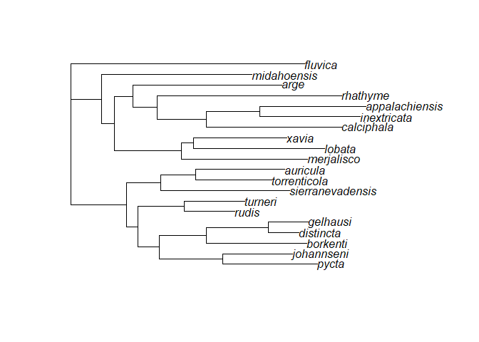
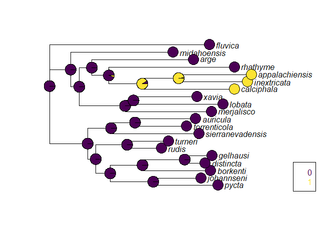

EEB 587 Week 6 Exercise
================
Jackson Turner
3/11/2022

More verbose and complete version coming soon; this is a placeholder
that will be updated shortly.

Load our packages.

``` r
library(ape)
library(geiger)
library(phangorn)
library(corHMM)
```

    ## Loading required package: nloptr

    ## Loading required package: GenSA

Load and format our data.

``` r
tree <- read.tree("RAxML_bestTree.T2.tre")
plot.phylo(tree) #plot the tree if you want
```

<!-- -->

``` r
discrete.data <- (read.csv(file="Co1_states.csv", stringsAsFactors=FALSE)) #read the csv file

#all states are 0 = absent & 1 = present
#barbs = if tailpipes have barbs 
#meringo = if dorsal coronae protrude to sides, paddles long and skinny
#rgroup = if heads and postspiracular process are black and larva is bulky
#tailpipe_fused = if tailpipe is connected to the postspiracular sclerite
#unknown_to_me = if i've never seen or worked with the larva in person

rownames(discrete.data) <- discrete.data[,1] #formatting the data
discrete.data<-discrete.data[,-1]
```

Visualize our data to validate that it’s not weird and format it some
more for the ancestral reconstruction models.

``` r
cleaned.discrete<-treedata(tree,data=discrete.data,sort=TRUE)# using the treedata() function to quality check it
(visualize_data<-cleaned.discrete) #look at it; it looks fine
```

    ## $phy
    ## 
    ## Phylogenetic tree with 20 tips and 18 internal nodes.
    ## 
    ## Tip labels:
    ##   pycta, johannseni, borkenti, distincta, gelhausi, rudis, ...
    ## 
    ## Rooted; includes branch lengths.
    ## 
    ## $data
    ##                  barbs meringo rgroup tailpipe_fused unknown_to_me
    ## pycta                0       0      1              1             0
    ## johannseni           0       0      0              0             1
    ## borkenti             0       0      1              1             0
    ## distincta            0       0      1              1             0
    ## gelhausi             0       0      1              1             0
    ## rudis                0       0      1              1             0
    ## turneri              0       0      1              1             0
    ## sierranevadensis     0       0      0              0             1
    ## torrenticola         0       0      1              1             0
    ## auricula             0       0      0              1             0
    ## merjalisco           0       0      0              0             1
    ## lobata               0       1      0              1             0
    ## xavia                0       1      0              1             0
    ## calciphala           1       0      0              0             0
    ## inextricata          1       0      0              0             0
    ## appalachiensis       1       0      0              0             0
    ## rhathyme             0       0      0              1             0
    ## arge                 0       1      0              1             0
    ## midahoensis          0       0      0              1             0
    ## fluvica              0       0      0              0             0

``` r
discrete.phyDat <- phangorn::phyDat((cleaned.discrete$data), type="USER",levels=c(0,1)) #formatting for functions later
```

Run our ancestral reconstruction model using parsimony.

``` r
anc.p <- phangorn::ancestral.pars(tree, discrete.phyDat[,1]) #using parsimony for ancestral reconstruction
plotAnc(tree, anc.p, 1) #behold
```

<!-- -->

There’s no uncertainty, which is variation in the probability that a
given node has a certain trait. This is because parsimony produces
reconstructions that require the same amount of changes no matter how
many trees you make (are equally parsimonious). (Losos, 1999)

``` r
anc.ml <- ancestral.pml(pml(tree, discrete.phyDat), type="ml") #using maximum likelihood for ancestral reconstruction
plotAnc(tree, anc.ml, 1) #pretty much the same but with more uncertainty
```

<!-- -->

There is uncertainty in the maximum likelihood model doesn’t minimize
the number of changes, but instead uses the data to determine the most
likely tree, leading to uncertainty.

Questions 1-4 coming soon\!
