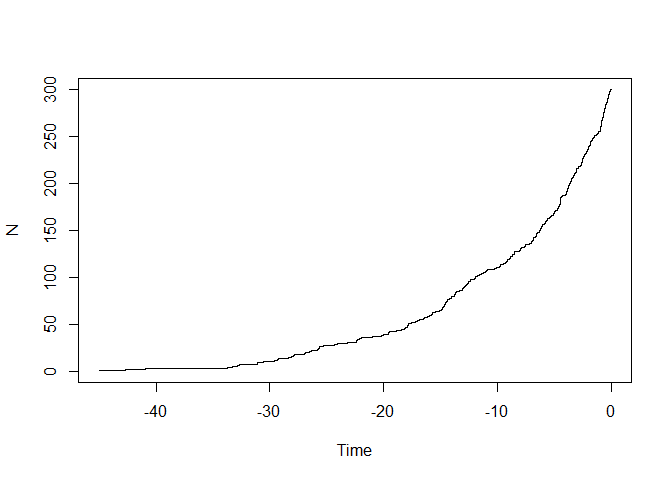
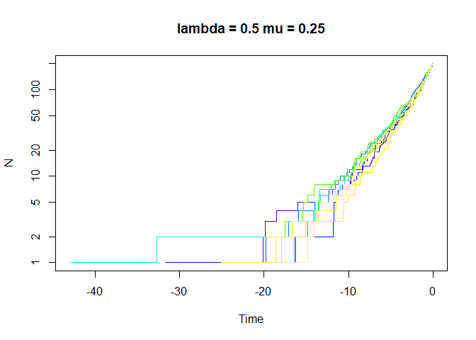

Diversification
================
Jackson Turner
4/18/2022

## Diversification Exercise

``` r
library(ape)
library(TreeSim)
```

    ## Warning: package 'TreeSim' was built under R version 4.1.3

    ## Loading required package: geiger

``` r
library(geiger)
library(diversitree)
```

    ## Warning: package 'diversitree' was built under R version 4.1.3

``` r
library(hisse)
```

    ## Warning: package 'hisse' was built under R version 4.1.3

    ## Loading required package: deSolve

    ## Loading required package: GenSA

    ## Loading required package: subplex

    ## Loading required package: nloptr

``` r
my.tree <- TreeSim::sim.bd.taxa(n=300, numbsim=1, lambda=0.1, mu=0)[[1]]

ape::ltt.plot(my.tree)
```

<!-- -->

``` r
ape::ltt.plot(my.tree, log="y")
```

<!-- -->

``` r
yule.trees <- TreeSim::sim.bd.taxa(n=300, numbsim=10, lambda=0.1, mu=0, complete=FALSE)

bd.trees <- TreeSim::sim.bd.taxa(n=300, numbsim=10, lambda=1, mu=.9, complete=FALSE)
ape::mltt.plot(bd.trees, log="y", legend=FALSE)
```

<!-- -->

``` r
depth.range <- range(unlist(lapply(yule.trees,ape::branching.times)), unlist(lapply(bd.trees,ape::branching.times)))
max.depth <- sum(abs(depth.range)) #ape rescales depths
plot(x=c(0, -1*max.depth), y=c(1, ape::Ntip(yule.trees[[1]])), log="y", type="n", bty="n", xlab="Time", ylab="N")
colors=c(rgb(1,0,0,0.5), rgb(0, 0, 0, 0.5))
list.of.both <- list(bd.trees, yule.trees)
for (i in sequence(2)) {
  tree.list <- list.of.both[[i]]
  for (j in sequence(length(tree.list))) {
    ape::ltt.lines(tree.list[[j]], col=colors[[i]])
  }
}
legend("topleft", legend=c("Birth Death", "Yule"), fill=colors)
```

<!-- -->

``` r
  depth.range <- range(unlist(lapply(yule.trees,ape::branching.times)), unlist(lapply(bd.trees,ape::branching.times)))
max.depth <- sum(abs(depth.range)) #ape rescales depths
plot(x=c(0, -5), y=c(200, ape::Ntip(yule.trees[[1]])), log="y", type="n", bty="n", xlab="Time", ylab="N")
colors=c(rgb(1,0,0,0.5), rgb(0, 0, 0, 0.5))
list.of.both <- list(bd.trees, yule.trees)
for (i in sequence(2)) {
  tree.list <- list.of.both[[i]]
  for (j in sequence(length(tree.list))) {
    ape::ltt.lines(tree.list[[j]], col=colors[[i]])
  }
}
legend("topleft", legend=c("Birth Death", "Yule"), fill=colors)
```

<!-- -->

``` r
my_lambda<-c(0.1,0.5,0.5,1,1,2,5,10)
my_mu<-c(0.05,0.25,0.4,0.95,0.25,1,4,9.7)

for(i in 1:length(my_lambda)){
  if(i==1){
  }
  
  my_temp_lambda<-my_lambda[i]
  my_temp_mu<-my_mu[i]
  temp_title<-paste("lambda =",my_lambda[i],"mu =",my_mu[i])
  
  temp_tree<-sim.bd.taxa(n=200, numbsim=10, lambda=my_temp_lambda, mu=my_temp_mu, complete=FALSE)
  mltt.plot(temp_tree, log="y", legend=FALSE)
  title(main=temp_title)
}
```

<!-- --><!-- --><!-- --><!-- --><!-- --><!-- --><!-- --><!-- -->

``` r
speciation.rates <- c(0.1, 0.1, 0.1, 0.2) #0A, 1A, 0B, 1B
extinction.rates <- rep(0.03, 4)
transition.rates <- c(0.01,0.01,0, 0.01, 0, 0.01, 0.01,0,0.01, 0,0.01,0.01)
pars <- c(speciation.rates, extinction.rates, transition.rates)
phy <- tree.musse(pars, max.taxa=50, x0=1, include.extinct=FALSE)
sim.dat.true <- data.frame(names(phy$tip.state), phy$tip.state)
sim.dat <- sim.dat.true
# Now to hide the "hidden" state
sim.dat[sim.dat[,2]==3,2] = 1
sim.dat[sim.dat[,2]==4,2] = 2
# and convert states 1,2 to 0,1
sim.dat[,2] = sim.dat[,2] - 1

plot(phy)
```

<!-- -->

``` r
knitr::kable(cbind(sim.dat, true.char=sim.dat.true$phy.tip.state))
```

|      | names.phy.tip.state. | phy.tip.state | true.char |
| :--- | :------------------- | ------------: | --------: |
| sp9  | sp9                  |             1 |         2 |
| sp10 | sp10                 |             0 |         3 |
| sp12 | sp12                 |             1 |         2 |
| sp17 | sp17                 |             1 |         4 |
| sp18 | sp18                 |             1 |         4 |
| sp19 | sp19                 |             1 |         4 |
| sp20 | sp20                 |             1 |         4 |
| sp21 | sp21                 |             1 |         4 |
| sp22 | sp22                 |             1 |         2 |
| sp23 | sp23                 |             1 |         4 |
| sp24 | sp24                 |             1 |         4 |
| sp25 | sp25                 |             1 |         2 |
| sp27 | sp27                 |             1 |         4 |
| sp28 | sp28                 |             1 |         2 |
| sp29 | sp29                 |             1 |         4 |
| sp31 | sp31                 |             1 |         4 |
| sp32 | sp32                 |             1 |         4 |
| sp33 | sp33                 |             1 |         2 |
| sp34 | sp34                 |             0 |         1 |
| sp35 | sp35                 |             1 |         4 |
| sp36 | sp36                 |             1 |         4 |
| sp37 | sp37                 |             1 |         4 |
| sp38 | sp38                 |             1 |         4 |
| sp39 | sp39                 |             1 |         4 |
| sp40 | sp40                 |             1 |         4 |
| sp41 | sp41                 |             1 |         4 |
| sp42 | sp42                 |             1 |         4 |
| sp43 | sp43                 |             1 |         4 |
| sp44 | sp44                 |             1 |         4 |
| sp45 | sp45                 |             1 |         4 |
| sp47 | sp47                 |             1 |         4 |
| sp48 | sp48                 |             1 |         4 |
| sp49 | sp49                 |             1 |         4 |
| sp50 | sp50                 |             1 |         4 |
| sp51 | sp51                 |             1 |         4 |
| sp52 | sp52                 |             1 |         4 |
| sp53 | sp53                 |             1 |         4 |
| sp54 | sp54                 |             1 |         4 |
| sp55 | sp55                 |             1 |         4 |
| sp56 | sp56                 |             1 |         4 |
| sp57 | sp57                 |             1 |         4 |
| sp58 | sp58                 |             1 |         4 |
| sp59 | sp59                 |             1 |         4 |
| sp60 | sp60                 |             1 |         4 |
| sp61 | sp61                 |             1 |         4 |
| sp62 | sp62                 |             1 |         4 |
| sp63 | sp63                 |             1 |         4 |
| sp64 | sp64                 |             1 |         4 |
| sp65 | sp65                 |             1 |         4 |
| sp66 | sp66                 |             1 |         4 |

``` r
turnover.anc = c(1,1,0,0)
eps.anc = c(1,1,0,0)

turnover.anc = c(1,2,0,0)

turnover.anc = c(1,2,3,4)

eps.anc = c(0,0,0,0)

trans.rates = TransMatMaker.old(hidden.states=TRUE)
trans.rates
```

    ##      (0A) (1A) (0B) (1B)
    ## (0A)   NA    4    7   10
    ## (1A)    1   NA    8   11
    ## (0B)    2    5   NA   12
    ## (1B)    3    6    9   NA

``` r
trans.rates.nodual = ParDrop(trans.rates, c(3,5,8,10))
trans.rates.nodual
```

    ##      (0A) (1A) (0B) (1B)
    ## (0A)   NA    3    5    0
    ## (1A)    1   NA    0    7
    ## (0B)    2    0   NA    8
    ## (1B)    0    4    6   NA

``` r
trans.rates.nodual.equal16 = ParEqual(trans.rates.nodual, c(1,6))
trans.rates.nodual.equal16
```

    ##      (0A) (1A) (0B) (1B)
    ## (0A)   NA    3    5    0
    ## (1A)    1   NA    0    6
    ## (0B)    2    0   NA    7
    ## (1B)    0    4    1   NA

``` r
trans.rates.nodual.allequal = ParEqual(trans.rates.nodual, c(1,2,1,3,1,4,1,5,1,6,1,7,1,8))
trans.rates.nodual.allequal
```

    ##      (0A) (1A) (0B) (1B)
    ## (0A)   NA    1    1    0
    ## (1A)    1   NA    0    1
    ## (0B)    1    0   NA    1
    ## (1B)    0    1    1   NA

``` r
trans.rates.nodual.allequal = trans.rates.nodual
trans.rates.nodual.allequal[!is.na(trans.rates.nodual.allequal) & !trans.rates.nodual.allequal == 0] = 1
trans.rates.nodual.allequal
```

    ##      (0A) (1A) (0B) (1B)
    ## (0A)   NA    1    1    0
    ## (1A)    1   NA    0    1
    ## (0B)    1    0   NA    1
    ## (1B)    0    1    1   NA

``` r
trans.rates.bisse = TransMatMaker.old(hidden.states=FALSE)
trans.rates.bisse
```

    ##     (0) (1)
    ## (0)  NA   2
    ## (1)   1  NA

``` r
pp = hisse.old(phy, sim.dat, f=c(1,1), hidden.states=TRUE, turnover.anc=turnover.anc,
               eps.anc=eps.anc, trans.rate=trans.rates.nodual.allequal)
```

    ## Initializing... 
    ## Finished. Beginning simulated annealing... 
    ## DLSODA-  At current T (=R1), MXSTEP (=I1) steps   
    ##       taken on this call before reaching TOUT     
    ## In above message, I1 = 5000
    ##  
    ## In above message, R1 = 1.89511
    ## 

    ## Warning in lsoda(yini, times, func = "maddison_DE_hisse", padded.pars, initfunc
    ## = "initmod_hisse", : an excessive amount of work (> maxsteps ) was done, but
    ## integration was not successful - increase maxsteps

    ## Warning in lsoda(yini, times, func = "maddison_DE_hisse", padded.pars, initfunc
    ## = "initmod_hisse", : Returning early. Results are accurate, as far as they go

    ## DLSODA-  At current T (=R1), MXSTEP (=I1) steps   
    ##       taken on this call before reaching TOUT     
    ## In above message, I1 = 5000
    ##  
    ## In above message, R1 = 2.78379
    ## 

    ## Warning in lsoda(yini, times, func = "maddison_DE_hisse", padded.pars, initfunc
    ## = "initmod_hisse", : an excessive amount of work (> maxsteps ) was done, but
    ## integration was not successful - increase maxsteps
    
    ## Warning in lsoda(yini, times, func = "maddison_DE_hisse", padded.pars, initfunc
    ## = "initmod_hisse", : Returning early. Results are accurate, as far as they go

    ## DLSODA-  At current T (=R1), MXSTEP (=I1) steps   
    ##       taken on this call before reaching TOUT     
    ## In above message, I1 = 5000
    ##  
    ## In above message, R1 = 27.173
    ## 

    ## Warning in lsoda(yini, times, func = "maddison_DE_hisse", padded.pars, initfunc
    ## = "initmod_hisse", : an excessive amount of work (> maxsteps ) was done, but
    ## integration was not successful - increase maxsteps
    
    ## Warning in lsoda(yini, times, func = "maddison_DE_hisse", padded.pars, initfunc
    ## = "initmod_hisse", : Returning early. Results are accurate, as far as they go

    ## DLSODA-  At current T (=R1), MXSTEP (=I1) steps   
    ##       taken on this call before reaching TOUT     
    ## In above message, I1 = 5000
    ##  
    ## In above message, R1 = 2.41643
    ## 

    ## Warning in lsoda(yini, times, func = "maddison_DE_hisse", padded.pars, initfunc
    ## = "initmod_hisse", : an excessive amount of work (> maxsteps ) was done, but
    ## integration was not successful - increase maxsteps
    
    ## Warning in lsoda(yini, times, func = "maddison_DE_hisse", padded.pars, initfunc
    ## = "initmod_hisse", : Returning early. Results are accurate, as far as they go

    ## DLSODA-  At current T (=R1), MXSTEP (=I1) steps   
    ##       taken on this call before reaching TOUT     
    ## In above message, I1 = 5000
    ##  
    ## In above message, R1 = 3.46538
    ## 

    ## Warning in lsoda(yini, times, func = "maddison_DE_hisse", padded.pars, initfunc
    ## = "initmod_hisse", : an excessive amount of work (> maxsteps ) was done, but
    ## integration was not successful - increase maxsteps
    
    ## Warning in lsoda(yini, times, func = "maddison_DE_hisse", padded.pars, initfunc
    ## = "initmod_hisse", : Returning early. Results are accurate, as far as they go

    ## DLSODA-  At current T (=R1), MXSTEP (=I1) steps   
    ##       taken on this call before reaching TOUT     
    ## In above message, I1 = 5000
    ##  
    ## In above message, R1 = 0.775321
    ## 

    ## Warning in lsoda(yini, times, func = "maddison_DE_hisse", padded.pars, initfunc
    ## = "initmod_hisse", : an excessive amount of work (> maxsteps ) was done, but
    ## integration was not successful - increase maxsteps
    
    ## Warning in lsoda(yini, times, func = "maddison_DE_hisse", padded.pars, initfunc
    ## = "initmod_hisse", : Returning early. Results are accurate, as far as they go

    ## DLSODA-  At current T (=R1), MXSTEP (=I1) steps   
    ##       taken on this call before reaching TOUT     
    ## In above message, I1 = 5000
    ##  
    ## In above message, R1 = 1.89511
    ## 

    ## Warning in lsoda(yini, times, func = "maddison_DE_hisse", padded.pars, initfunc
    ## = "initmod_hisse", : an excessive amount of work (> maxsteps ) was done, but
    ## integration was not successful - increase maxsteps
    
    ## Warning in lsoda(yini, times, func = "maddison_DE_hisse", padded.pars, initfunc
    ## = "initmod_hisse", : Returning early. Results are accurate, as far as they go

    ## DLSODA-  At current T (=R1), MXSTEP (=I1) steps   
    ##       taken on this call before reaching TOUT     
    ## In above message, I1 = 5000
    ##  
    ## In above message, R1 = 0.56214
    ## 

    ## Warning in lsoda(yini, times, func = "maddison_DE_hisse", padded.pars, initfunc
    ## = "initmod_hisse", : an excessive amount of work (> maxsteps ) was done, but
    ## integration was not successful - increase maxsteps
    
    ## Warning in lsoda(yini, times, func = "maddison_DE_hisse", padded.pars, initfunc
    ## = "initmod_hisse", : Returning early. Results are accurate, as far as they go

    ## DLSODA-  At current T (=R1), MXSTEP (=I1) steps   
    ##       taken on this call before reaching TOUT     
    ## In above message, I1 = 5000
    ##  
    ## In above message, R1 = 5.06317
    ## 

    ## Warning in lsoda(yini, times, func = "maddison_DE_hisse", padded.pars, initfunc
    ## = "initmod_hisse", : an excessive amount of work (> maxsteps ) was done, but
    ## integration was not successful - increase maxsteps
    
    ## Warning in lsoda(yini, times, func = "maddison_DE_hisse", padded.pars, initfunc
    ## = "initmod_hisse", : Returning early. Results are accurate, as far as they go

    ## DLSODA-  At current T (=R1), MXSTEP (=I1) steps   
    ##       taken on this call before reaching TOUT     
    ## In above message, I1 = 5000
    ##  
    ## In above message, R1 = 4.88935
    ## 

    ## Warning in lsoda(yini, times, func = "maddison_DE_hisse", padded.pars, initfunc
    ## = "initmod_hisse", : an excessive amount of work (> maxsteps ) was done, but
    ## integration was not successful - increase maxsteps
    
    ## Warning in lsoda(yini, times, func = "maddison_DE_hisse", padded.pars, initfunc
    ## = "initmod_hisse", : Returning early. Results are accurate, as far as they go

    ## DLSODA-  At current T (=R1), MXSTEP (=I1) steps   
    ##       taken on this call before reaching TOUT     
    ## In above message, I1 = 5000
    ##  
    ## In above message, R1 = 0.775321
    ## 

    ## Warning in lsoda(yini, times, func = "maddison_DE_hisse", padded.pars, initfunc
    ## = "initmod_hisse", : an excessive amount of work (> maxsteps ) was done, but
    ## integration was not successful - increase maxsteps
    
    ## Warning in lsoda(yini, times, func = "maddison_DE_hisse", padded.pars, initfunc
    ## = "initmod_hisse", : Returning early. Results are accurate, as far as they go

    ## DLSODA-  At current T (=R1), MXSTEP (=I1) steps   
    ##       taken on this call before reaching TOUT     
    ## In above message, I1 = 5000
    ##  
    ## In above message, R1 = 6.37728
    ## 

    ## Warning in lsoda(yini, times, func = "maddison_DE_hisse", padded.pars, initfunc
    ## = "initmod_hisse", : an excessive amount of work (> maxsteps ) was done, but
    ## integration was not successful - increase maxsteps
    
    ## Warning in lsoda(yini, times, func = "maddison_DE_hisse", padded.pars, initfunc
    ## = "initmod_hisse", : Returning early. Results are accurate, as far as they go

    ## DLSODA-  At current T (=R1), MXSTEP (=I1) steps   
    ##       taken on this call before reaching TOUT     
    ## In above message, I1 = 5000
    ##  
    ## In above message, R1 = 3.88808
    ## 

    ## Warning in lsoda(yini, times, func = "maddison_DE_hisse", padded.pars, initfunc
    ## = "initmod_hisse", : an excessive amount of work (> maxsteps ) was done, but
    ## integration was not successful - increase maxsteps
    
    ## Warning in lsoda(yini, times, func = "maddison_DE_hisse", padded.pars, initfunc
    ## = "initmod_hisse", : Returning early. Results are accurate, as far as they go

    ## DLSODA-  At current T (=R1), MXSTEP (=I1) steps   
    ##       taken on this call before reaching TOUT     
    ## In above message, I1 = 5000
    ##  
    ## In above message, R1 = 1.62863
    ## 

    ## Warning in lsoda(yini, times, func = "maddison_DE_hisse", padded.pars, initfunc
    ## = "initmod_hisse", : an excessive amount of work (> maxsteps ) was done, but
    ## integration was not successful - increase maxsteps
    
    ## Warning in lsoda(yini, times, func = "maddison_DE_hisse", padded.pars, initfunc
    ## = "initmod_hisse", : Returning early. Results are accurate, as far as they go

    ## DLSODA-  At current T (=R1), MXSTEP (=I1) steps   
    ##       taken on this call before reaching TOUT     
    ## In above message, I1 = 5000
    ##  
    ## In above message, R1 = 10.6117
    ## 

    ## Warning in lsoda(yini, times, func = "maddison_DE_hisse", padded.pars, initfunc
    ## = "initmod_hisse", : an excessive amount of work (> maxsteps ) was done, but
    ## integration was not successful - increase maxsteps
    
    ## Warning in lsoda(yini, times, func = "maddison_DE_hisse", padded.pars, initfunc
    ## = "initmod_hisse", : Returning early. Results are accurate, as far as they go

    ## Finished. Refining using subplex routine... 
    ## Finished. Summarizing results...

``` r
pp = hisse.old(phy, sim.dat, f=c(1,1), hidden.states=TRUE, turnover.anc=turnover.anc,
               eps.anc=eps.anc, trans.rate=trans.rates.nodual.allequal, output.type="net.div")
```

    ## Initializing... 
    ## Finished. Beginning simulated annealing... 
    ## DLSODA-  At current T (=R1), MXSTEP (=I1) steps   
    ##       taken on this call before reaching TOUT     
    ## In above message, I1 = 5000
    ##  
    ## In above message, R1 = 1.89511
    ## 

    ## Warning in lsoda(yini, times, func = "maddison_DE_hisse", padded.pars, initfunc
    ## = "initmod_hisse", : an excessive amount of work (> maxsteps ) was done, but
    ## integration was not successful - increase maxsteps
    
    ## Warning in lsoda(yini, times, func = "maddison_DE_hisse", padded.pars, initfunc
    ## = "initmod_hisse", : Returning early. Results are accurate, as far as they go

    ## DLSODA-  At current T (=R1), MXSTEP (=I1) steps   
    ##       taken on this call before reaching TOUT     
    ## In above message, I1 = 5000
    ##  
    ## In above message, R1 = 2.78379
    ## 

    ## Warning in lsoda(yini, times, func = "maddison_DE_hisse", padded.pars, initfunc
    ## = "initmod_hisse", : an excessive amount of work (> maxsteps ) was done, but
    ## integration was not successful - increase maxsteps
    
    ## Warning in lsoda(yini, times, func = "maddison_DE_hisse", padded.pars, initfunc
    ## = "initmod_hisse", : Returning early. Results are accurate, as far as they go

    ## DLSODA-  At current T (=R1), MXSTEP (=I1) steps   
    ##       taken on this call before reaching TOUT     
    ## In above message, I1 = 5000
    ##  
    ## In above message, R1 = 27.173
    ## 

    ## Warning in lsoda(yini, times, func = "maddison_DE_hisse", padded.pars, initfunc
    ## = "initmod_hisse", : an excessive amount of work (> maxsteps ) was done, but
    ## integration was not successful - increase maxsteps
    
    ## Warning in lsoda(yini, times, func = "maddison_DE_hisse", padded.pars, initfunc
    ## = "initmod_hisse", : Returning early. Results are accurate, as far as they go

    ## DLSODA-  At current T (=R1), MXSTEP (=I1) steps   
    ##       taken on this call before reaching TOUT     
    ## In above message, I1 = 5000
    ##  
    ## In above message, R1 = 2.41643
    ## 

    ## Warning in lsoda(yini, times, func = "maddison_DE_hisse", padded.pars, initfunc
    ## = "initmod_hisse", : an excessive amount of work (> maxsteps ) was done, but
    ## integration was not successful - increase maxsteps
    
    ## Warning in lsoda(yini, times, func = "maddison_DE_hisse", padded.pars, initfunc
    ## = "initmod_hisse", : Returning early. Results are accurate, as far as they go

    ## DLSODA-  At current T (=R1), MXSTEP (=I1) steps   
    ##       taken on this call before reaching TOUT     
    ## In above message, I1 = 5000
    ##  
    ## In above message, R1 = 3.46538
    ## 

    ## Warning in lsoda(yini, times, func = "maddison_DE_hisse", padded.pars, initfunc
    ## = "initmod_hisse", : an excessive amount of work (> maxsteps ) was done, but
    ## integration was not successful - increase maxsteps
    
    ## Warning in lsoda(yini, times, func = "maddison_DE_hisse", padded.pars, initfunc
    ## = "initmod_hisse", : Returning early. Results are accurate, as far as they go

    ## DLSODA-  At current T (=R1), MXSTEP (=I1) steps   
    ##       taken on this call before reaching TOUT     
    ## In above message, I1 = 5000
    ##  
    ## In above message, R1 = 0.775321
    ## 

    ## Warning in lsoda(yini, times, func = "maddison_DE_hisse", padded.pars, initfunc
    ## = "initmod_hisse", : an excessive amount of work (> maxsteps ) was done, but
    ## integration was not successful - increase maxsteps
    
    ## Warning in lsoda(yini, times, func = "maddison_DE_hisse", padded.pars, initfunc
    ## = "initmod_hisse", : Returning early. Results are accurate, as far as they go

    ## DLSODA-  At current T (=R1), MXSTEP (=I1) steps   
    ##       taken on this call before reaching TOUT     
    ## In above message, I1 = 5000
    ##  
    ## In above message, R1 = 1.89511
    ## 

    ## Warning in lsoda(yini, times, func = "maddison_DE_hisse", padded.pars, initfunc
    ## = "initmod_hisse", : an excessive amount of work (> maxsteps ) was done, but
    ## integration was not successful - increase maxsteps
    
    ## Warning in lsoda(yini, times, func = "maddison_DE_hisse", padded.pars, initfunc
    ## = "initmod_hisse", : Returning early. Results are accurate, as far as they go

    ## DLSODA-  At current T (=R1), MXSTEP (=I1) steps   
    ##       taken on this call before reaching TOUT     
    ## In above message, I1 = 5000
    ##  
    ## In above message, R1 = 0.56214
    ## 

    ## Warning in lsoda(yini, times, func = "maddison_DE_hisse", padded.pars, initfunc
    ## = "initmod_hisse", : an excessive amount of work (> maxsteps ) was done, but
    ## integration was not successful - increase maxsteps
    
    ## Warning in lsoda(yini, times, func = "maddison_DE_hisse", padded.pars, initfunc
    ## = "initmod_hisse", : Returning early. Results are accurate, as far as they go

    ## DLSODA-  At current T (=R1), MXSTEP (=I1) steps   
    ##       taken on this call before reaching TOUT     
    ## In above message, I1 = 5000
    ##  
    ## In above message, R1 = 5.06317
    ## 

    ## Warning in lsoda(yini, times, func = "maddison_DE_hisse", padded.pars, initfunc
    ## = "initmod_hisse", : an excessive amount of work (> maxsteps ) was done, but
    ## integration was not successful - increase maxsteps
    
    ## Warning in lsoda(yini, times, func = "maddison_DE_hisse", padded.pars, initfunc
    ## = "initmod_hisse", : Returning early. Results are accurate, as far as they go

    ## DLSODA-  At current T (=R1), MXSTEP (=I1) steps   
    ##       taken on this call before reaching TOUT     
    ## In above message, I1 = 5000
    ##  
    ## In above message, R1 = 4.88935
    ## 

    ## Warning in lsoda(yini, times, func = "maddison_DE_hisse", padded.pars, initfunc
    ## = "initmod_hisse", : an excessive amount of work (> maxsteps ) was done, but
    ## integration was not successful - increase maxsteps
    
    ## Warning in lsoda(yini, times, func = "maddison_DE_hisse", padded.pars, initfunc
    ## = "initmod_hisse", : Returning early. Results are accurate, as far as they go

    ## DLSODA-  At current T (=R1), MXSTEP (=I1) steps   
    ##       taken on this call before reaching TOUT     
    ## In above message, I1 = 5000
    ##  
    ## In above message, R1 = 0.775321
    ## 

    ## Warning in lsoda(yini, times, func = "maddison_DE_hisse", padded.pars, initfunc
    ## = "initmod_hisse", : an excessive amount of work (> maxsteps ) was done, but
    ## integration was not successful - increase maxsteps
    
    ## Warning in lsoda(yini, times, func = "maddison_DE_hisse", padded.pars, initfunc
    ## = "initmod_hisse", : Returning early. Results are accurate, as far as they go

    ## DLSODA-  At current T (=R1), MXSTEP (=I1) steps   
    ##       taken on this call before reaching TOUT     
    ## In above message, I1 = 5000
    ##  
    ## In above message, R1 = 6.37728
    ## 

    ## Warning in lsoda(yini, times, func = "maddison_DE_hisse", padded.pars, initfunc
    ## = "initmod_hisse", : an excessive amount of work (> maxsteps ) was done, but
    ## integration was not successful - increase maxsteps
    
    ## Warning in lsoda(yini, times, func = "maddison_DE_hisse", padded.pars, initfunc
    ## = "initmod_hisse", : Returning early. Results are accurate, as far as they go

    ## DLSODA-  At current T (=R1), MXSTEP (=I1) steps   
    ##       taken on this call before reaching TOUT     
    ## In above message, I1 = 5000
    ##  
    ## In above message, R1 = 3.88808
    ## 

    ## Warning in lsoda(yini, times, func = "maddison_DE_hisse", padded.pars, initfunc
    ## = "initmod_hisse", : an excessive amount of work (> maxsteps ) was done, but
    ## integration was not successful - increase maxsteps
    
    ## Warning in lsoda(yini, times, func = "maddison_DE_hisse", padded.pars, initfunc
    ## = "initmod_hisse", : Returning early. Results are accurate, as far as they go

    ## DLSODA-  At current T (=R1), MXSTEP (=I1) steps   
    ##       taken on this call before reaching TOUT     
    ## In above message, I1 = 5000
    ##  
    ## In above message, R1 = 1.62863
    ## 

    ## Warning in lsoda(yini, times, func = "maddison_DE_hisse", padded.pars, initfunc
    ## = "initmod_hisse", : an excessive amount of work (> maxsteps ) was done, but
    ## integration was not successful - increase maxsteps
    
    ## Warning in lsoda(yini, times, func = "maddison_DE_hisse", padded.pars, initfunc
    ## = "initmod_hisse", : Returning early. Results are accurate, as far as they go

    ## DLSODA-  At current T (=R1), MXSTEP (=I1) steps   
    ##       taken on this call before reaching TOUT     
    ## In above message, I1 = 5000
    ##  
    ## In above message, R1 = 10.6117
    ## 

    ## Warning in lsoda(yini, times, func = "maddison_DE_hisse", padded.pars, initfunc
    ## = "initmod_hisse", : an excessive amount of work (> maxsteps ) was done, but
    ## integration was not successful - increase maxsteps
    
    ## Warning in lsoda(yini, times, func = "maddison_DE_hisse", padded.pars, initfunc
    ## = "initmod_hisse", : Returning early. Results are accurate, as far as they go

    ## Finished. Refining using subplex routine... 
    ## Finished. Summarizing results...

``` r
turnover.anc = c(1,1,2,2)
eps.anc = c(1,1,2,2)

trans.rates = TransMatMaker.old(hidden.states=TRUE)
trans.rates.nodual = ParDrop(trans.rates, c(3,5,8,10))

trans.rates.nodual.allequal = ParEqual(trans.rates.nodual, c(1,2,1,3,1,4,1,5,1,6,1,7,1,8))
trans.rates.nodual.allequal
```

    ##      (0A) (1A) (0B) (1B)
    ## (0A)   NA    1    1    0
    ## (1A)    1   NA    0    1
    ## (0B)    1    0   NA    1
    ## (1B)    0    1    1   NA

``` r
# Now we want three specific rates:
trans.rates.nodual.threerates <- trans.rates.nodual
# Set all transitions from 0->1 to be governed by a single rate:
to.change <- cbind(c(1,3), c(2,4))
trans.rates.nodual.threerates[to.change] = 1
# Now set all transitions from 1->0 to be governed by a single rate:
to.change <- cbind(c(2,4), c(1,3))
trans.rates.nodual.threerates[to.change] = 2
# Finally, set all transitions between the hidden state to be a single rate (essentially giving
# you an estimate of the rate by which shifts in diversification occur:
to.change <- cbind(c(1,3,2,4), c(3,1,4,2))
trans.rates.nodual.threerates[to.change] = 3
trans.rates.nodual.threerates
```

    ##      (0A) (1A) (0B) (1B)
    ## (0A)   NA    1    3    0
    ## (1A)    2   NA    0    3
    ## (0B)    3    0   NA    1
    ## (1B)    0    3    2   NA

``` r
pp = hisse.old(phy, sim.dat, f=c(1,1), hidden.states=TRUE, turnover.anc=turnover.anc,
           eps.anc=eps.anc, trans.rate=trans.rates.nodual.allequal)
```

    ## Initializing... 
    ## Finished. Beginning simulated annealing... 
    ## DLSODA-  At current T (=R1), MXSTEP (=I1) steps   
    ##       taken on this call before reaching TOUT     
    ## In above message, I1 = 5000
    ##  
    ## In above message, R1 = 0.539137
    ## 

    ## Warning in lsoda(yini, times, func = "maddison_DE_hisse", padded.pars, initfunc
    ## = "initmod_hisse", : an excessive amount of work (> maxsteps ) was done, but
    ## integration was not successful - increase maxsteps
    
    ## Warning in lsoda(yini, times, func = "maddison_DE_hisse", padded.pars, initfunc
    ## = "initmod_hisse", : Returning early. Results are accurate, as far as they go

    ## DLSODA-  At current T (=R1), MXSTEP (=I1) steps   
    ##       taken on this call before reaching TOUT     
    ## In above message, I1 = 5000
    ##  
    ## In above message, R1 = 1.85623
    ## 

    ## Warning in lsoda(yini, times, func = "maddison_DE_hisse", padded.pars, initfunc
    ## = "initmod_hisse", : an excessive amount of work (> maxsteps ) was done, but
    ## integration was not successful - increase maxsteps
    
    ## Warning in lsoda(yini, times, func = "maddison_DE_hisse", padded.pars, initfunc
    ## = "initmod_hisse", : Returning early. Results are accurate, as far as they go

    ## DLSODA-  At current T (=R1), MXSTEP (=I1) steps   
    ##       taken on this call before reaching TOUT     
    ## In above message, I1 = 5000
    ##  
    ## In above message, R1 = 9.57584
    ## 

    ## Warning in lsoda(yini, times, func = "maddison_DE_hisse", padded.pars, initfunc
    ## = "initmod_hisse", : an excessive amount of work (> maxsteps ) was done, but
    ## integration was not successful - increase maxsteps
    
    ## Warning in lsoda(yini, times, func = "maddison_DE_hisse", padded.pars, initfunc
    ## = "initmod_hisse", : Returning early. Results are accurate, as far as they go

    ## DLSODA-  At current T (=R1), MXSTEP (=I1) steps   
    ##       taken on this call before reaching TOUT     
    ## In above message, I1 = 5000
    ##  
    ## In above message, R1 = 3.18241
    ## 

    ## Warning in lsoda(yini, times, func = "maddison_DE_hisse", padded.pars, initfunc
    ## = "initmod_hisse", : an excessive amount of work (> maxsteps ) was done, but
    ## integration was not successful - increase maxsteps
    
    ## Warning in lsoda(yini, times, func = "maddison_DE_hisse", padded.pars, initfunc
    ## = "initmod_hisse", : Returning early. Results are accurate, as far as they go

    ## DLSODA-  At current T (=R1), MXSTEP (=I1) steps   
    ##       taken on this call before reaching TOUT     
    ## In above message, I1 = 5000
    ##  
    ## In above message, R1 = 2.78379
    ## 

    ## Warning in lsoda(yini, times, func = "maddison_DE_hisse", padded.pars, initfunc
    ## = "initmod_hisse", : an excessive amount of work (> maxsteps ) was done, but
    ## integration was not successful - increase maxsteps
    
    ## Warning in lsoda(yini, times, func = "maddison_DE_hisse", padded.pars, initfunc
    ## = "initmod_hisse", : Returning early. Results are accurate, as far as they go

    ## DLSODA-  At current T (=R1), MXSTEP (=I1) steps   
    ##       taken on this call before reaching TOUT     
    ## In above message, I1 = 5000
    ##  
    ## In above message, R1 = 5.66398
    ## 

    ## Warning in lsoda(yini, times, func = "maddison_DE_hisse", padded.pars, initfunc
    ## = "initmod_hisse", : an excessive amount of work (> maxsteps ) was done, but
    ## integration was not successful - increase maxsteps
    
    ## Warning in lsoda(yini, times, func = "maddison_DE_hisse", padded.pars, initfunc
    ## = "initmod_hisse", : Returning early. Results are accurate, as far as they go

    ## DLSODA-  At current T (=R1), MXSTEP (=I1) steps   
    ##       taken on this call before reaching TOUT     
    ## In above message, I1 = 5000
    ##  
    ## In above message, R1 = 6.43999
    ## 

    ## Warning in lsoda(yini, times, func = "maddison_DE_hisse", padded.pars, initfunc
    ## = "initmod_hisse", : an excessive amount of work (> maxsteps ) was done, but
    ## integration was not successful - increase maxsteps
    
    ## Warning in lsoda(yini, times, func = "maddison_DE_hisse", padded.pars, initfunc
    ## = "initmod_hisse", : Returning early. Results are accurate, as far as they go

    ## DLSODA-  At current T (=R1), MXSTEP (=I1) steps   
    ##       taken on this call before reaching TOUT     
    ## In above message, I1 = 5000
    ##  
    ## In above message, R1 = 3.34664
    ## 

    ## Warning in lsoda(yini, times, func = "maddison_DE_hisse", padded.pars, initfunc
    ## = "initmod_hisse", : an excessive amount of work (> maxsteps ) was done, but
    ## integration was not successful - increase maxsteps
    
    ## Warning in lsoda(yini, times, func = "maddison_DE_hisse", padded.pars, initfunc
    ## = "initmod_hisse", : Returning early. Results are accurate, as far as they go

    ## Finished. Refining using subplex routine... 
    ## Finished. Summarizing results...

``` r
load("testrecon1.rda")
class(pp.recon)
```

    ## [1] "hisse.states"

``` r
pp.recon
```

    ## 
    ## Phylogenetic tree with 50 tips and 49 internal nodes.
    ## 
    ## Tip labels:
    ##   sp15, sp57, sp58, sp49, sp50, sp42, ...
    ## Node labels:
    ##   1, 3, 1, 1, 1, 1, ...
    ## 
    ## Rooted; includes branch lengths.

``` r
plot.hisse.states(pp.recon, rate.param="net.div", show.tip.label=FALSE)
```

<!-- -->

    ## $rate.tree
    ## Object of class "contMap" containing:
    ## 
    ## (1) A phylogenetic tree with 50 tips and 49 internal nodes.
    ## 
    ## (2) A mapped continuous trait on the range (0.066161, 0.069176).
    ## 
    ## 
    ## $state.tree
    ## Object of class "contMap" containing:
    ## 
    ## (1) A phylogenetic tree with 50 tips and 49 internal nodes.
    ## 
    ## (2) A mapped continuous trait on the range (0, 1.001).

``` r
plot.hisse.states(pp.recon, rate.param="net.div", show.tip.label=FALSE, rate.range=c(0,0.072))
```

<!-- -->

    ## $rate.tree
    ## Object of class "contMap" containing:
    ## 
    ## (1) A phylogenetic tree with 50 tips and 49 internal nodes.
    ## 
    ## (2) A mapped continuous trait on the range (0, 0.072072).
    ## 
    ## 
    ## $state.tree
    ## Object of class "contMap" containing:
    ## 
    ## (1) A phylogenetic tree with 50 tips and 49 internal nodes.
    ## 
    ## (2) A mapped continuous trait on the range (0, 1.001).

``` r
pp.recon$aic
```

    ## [1] 364.8615

``` r
hisse.results.list = list()
load("testrecon1.rda")
hisse.results.list[[1]] = pp.recon
load("testrecon2.rda")
hisse.results.list[[2]] = pp.recon
load("testrecon3.rda")
hisse.results.list[[3]] = pp.recon
# Now supply the list the plotting function
plot.hisse.states(hisse.results.list, rate.param="net.div", show.tip.label=FALSE, rate.range=c(0,0.072))
```

<!-- -->

    ## $rate.tree
    ## Object of class "contMap" containing:
    ## 
    ## (1) A phylogenetic tree with 50 tips and 49 internal nodes.
    ## 
    ## (2) A mapped continuous trait on the range (0, 0.072072).
    ## 
    ## 
    ## $state.tree
    ## Object of class "contMap" containing:
    ## 
    ## (1) A phylogenetic tree with 50 tips and 49 internal nodes.
    ## 
    ## (2) A mapped continuous trait on the range (0, 1.001).
