Estimating Tree Similarity Using Permutational Hypothesis Testing
================
Jackson Turner
5/18/2022

## Comparing Two Phylogenies Using Permutational Hypothesis Testing:

There are several ways to compare the phylogenies of two different
organisms, and one way to do that is to use a permutational hypothesis
test to evlaluate if two phylogenies share a significantly high or low
number of clades. For the sake of this exercise, I’ll be using host and
endosymbiont phylogenies constructed from unpublished data using Dixidae
(Diptera:Culicidae) CO1 genes and Rickettsial SNP data respectively. My
H1 and H0 are as follows:

H1: Host and endosymbiont trees share a different number of clades than
the host tree and randomly-generated trees.

H0: Host and endosymbiont trees share the same number of clades as the
host tree and randomly-generated trees.

I’ll test my hypothesis by simulating several random trees with the same
tip labels as the host tree and extracting the number of shared clades –
as I continue to sample, the number of shared clades between these
random trees and my actual tree will represent my hypothesis that host
and endosymbiont trees are different. Then, I’ll plot the number of
shared clades as a histogram and then the number of shared clades
between the actual host and endosymbiont trees as an abline to see where
it falls. If it’s within the range of a normal distribution then my
hypothesis will supported\! Though, I’ll need to account for the fact
that that the tree I have probably isn’t the actual tree – and the same
is true for the endosymbiont tree.

Load our packages.

Load in the host (dixid) tree constructed from CO1 data using RAxML

``` r
dixid_tree<-read.tree("all_CO1_GTRCAT.TREE")
plot(dixid_tree)
```

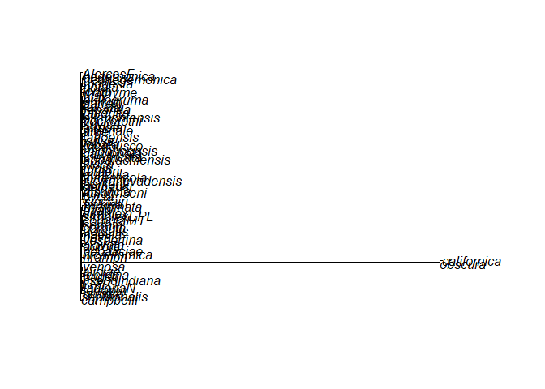<!-- -->

Load in our endosymbiont trees. These are both generated from
Rickettsial SNP data using vcf2poptree – one is generated using UPGMA
and the other using neighor-joining methods, both from the same SNP
data.

``` r
UPGMA_endosymbiont_tree<-read.tree("Rickettsia_UPGMA.TREE")
plot(UPGMA_endosymbiont_tree)
```

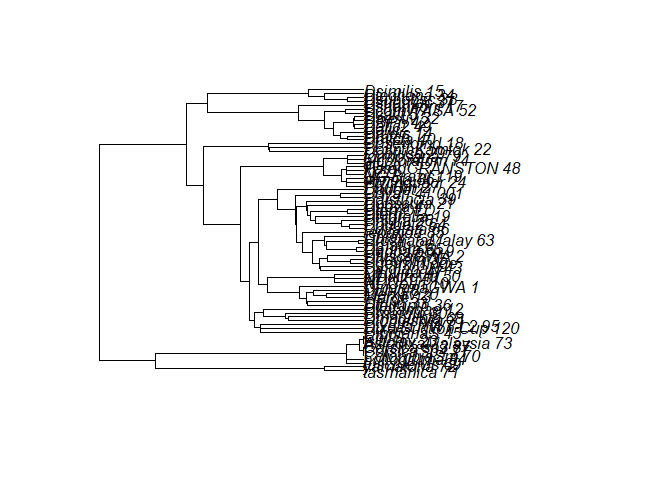<!-- -->

``` r
NJ_endosymbiont_tree<-read.tree("Rickettsia_NJ.TREE")
plot(NJ_endosymbiont_tree)
```

    ## Warning in plot.phylo(NJ_endosymbiont_tree): 1 branch length(s) NA(s): branch
    ## lengths ignored in the plot

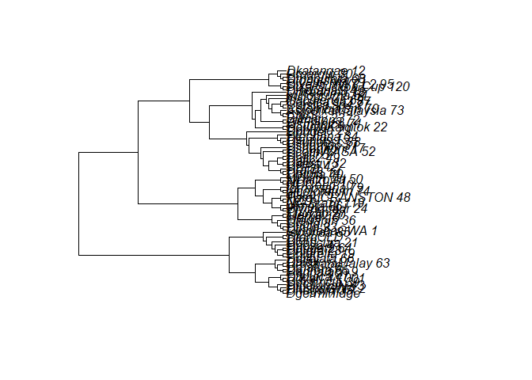<!-- -->

Extract the names of the tips to build the random trees.

``` r
dixid_tip_label_names<-NJ_endosymbiont_tree$tip.label
```

As of 5/18/22 I don’t have a host phylogeny from the same taxa as the
endosymbiont trees, so I’m creating a new host tree using `rtree()` and
the endosymbiont tip labels.

``` r
set.seed(31)
dixid_tree<-rtree(n=length(dixid_tip_label_names),rooted=TRUE,tip.label=dixid_tip_label_names)
```

Load in helpful functions used to retrieve the shared clades between two
trees (thanks Dr. Brian O’Meara\!).

``` r
GetTerminalDescendants <- function(tree) {
  return(Descendants(tree, ((1+ape::Ntip(tree)):(ape::Nnode(tree)+ape::Ntip(tree))), type="tips"))
}

ConvertTipVectorToString <- function(x) {
  return(paste0(sort(x), collapse="_"))
}
```

Retrieve the clades in the dixid tree in a usable format.

``` r
tree_clades <- simplify2array(lapply(GetTerminalDescendants(dixid_tree), ConvertTipVectorToString))
```

Create an empty vector for the number of overlapping trees, and then
generate 10,000 random trees using `rcoal()`and retrieve the number of
shared clades with the host tree

``` r
number_overlapping_clades <- as.vector(NULL)
for (i in 1:10000){
  temp_tree<-rcoal(n=length(dixid_tip_label_names),rooted=TRUE,tip.label=dixid_tip_label_names)
  temp_tree_clades <- simplify2array(lapply(GetTerminalDescendants(temp_tree), ConvertTipVectorToString))
  number_overlapping_clades[i] <- sum(temp_tree_clades %in% tree_clades)
}
```

How many clades, on average, do these random trees share with the host
tree? This should strongly resemble a normal distribution because of the
Central Limits Theorem.

**How to interpret these plots:**

**The thick dotted line represents two standard deviations away from the
mean of the distribution, the thin line represents three standard
deviations away from the mean of the distribution, and the blue line
represents where the tested value falls**

I use a histogram for this plot but I use density plots for the rest
since they would display similar results for this exercise.

``` r
hist(number_overlapping_clades,xlab="Number of shared clades",main="")
abline(v=mean(number_overlapping_clades),lwd=3,col="blue")
clade_sd<-sd(number_overlapping_clades)
abline(v=(mean(number_overlapping_clades))-2*clade_sd,lwd=2,lty=2)
abline(v=(mean(number_overlapping_clades))+2*clade_sd,lwd=2,lty=2)
abline(v=(mean(number_overlapping_clades))-3*clade_sd,lwd=1,lty=2)
abline(v=(mean(number_overlapping_clades))+3*clade_sd,lwd=1,lty=2)
```

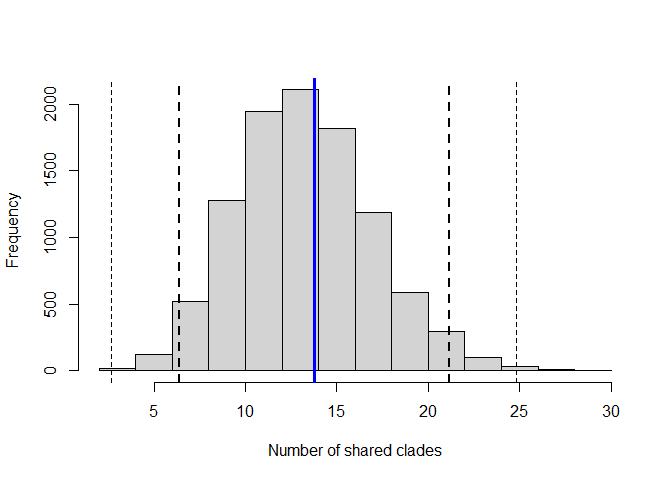

How many clades do our endosymbiont trees share with the host tree?

``` r
UPGMA_endosymbiont_tree_clades <- simplify2array(lapply(GetTerminalDescendants(UPGMA_endosymbiont_tree), ConvertTipVectorToString))
NJ_endosymbiont_tree_clades <- simplify2array(lapply(GetTerminalDescendants(NJ_endosymbiont_tree), ConvertTipVectorToString))

UPGMA_endosymbiont_tree_overlapping_clades<- sum(UPGMA_endosymbiont_tree_clades %in% tree_clades)
NJ_endosymbiont_tree_overlapping_clades<- sum(NJ_endosymbiont_tree_clades %in% tree_clades)
```

To evaluate whether the number of shared clades between the host and
endosymbiont trees is significant, we’ll use the number of overlapping
clades we generated from our random trees earlier as a null hypothesis.
Therefore, if the number of shared clades is much higher or lower than
our null hypothesis, we can reject it, inferring that our endosymbiont
tree is not one drawn from this distribution of randomly generated
trees. Otherwise, we couldn’t prove that the number of clades shared
between these two trees is any different than if the endosymbiont tree
was randomly generated.

``` r
plot(density(number_overlapping_clades),xlab="Number of shared clades",main="")
abline(v=(mean(number_overlapping_clades))-2*clade_sd,lwd=2,lty=2)
abline(v=(mean(number_overlapping_clades))+2*clade_sd,lwd=2,lty=2)
abline(v=(mean(number_overlapping_clades))-3*clade_sd,lwd=1,lty=2)
abline(v=(mean(number_overlapping_clades))+3*clade_sd,lwd=1,lty=2)

abline(v=UPGMA_endosymbiont_tree_overlapping_clades,lwd=3,col="blue")
```

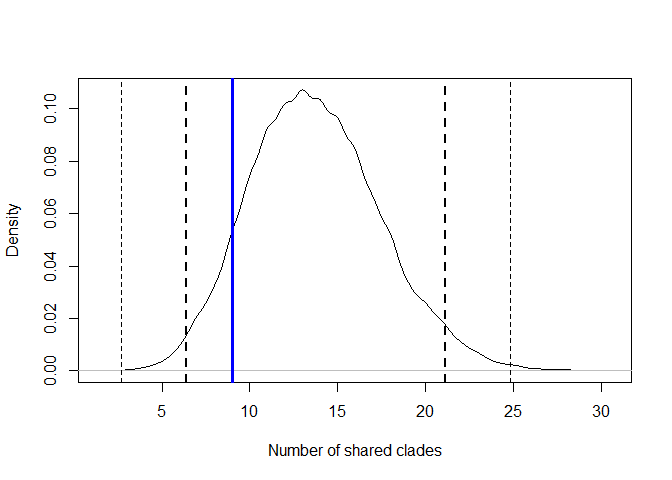

The UPGMA tree shares 9 clades with the host tree. Because this the
number of clades shared between the UPGMA endosymbiont tree and the host
tree falls within two standard deviations of the mean of randomly
generated trees, we cannot reject our null hypothesis of this tree being
a randomly-generated tree.

``` r
plot(density(number_overlapping_clades),xlab="Number of shared clades",main="")
abline(v=(mean(number_overlapping_clades))-2*clade_sd,lwd=2,lty=2)
abline(v=(mean(number_overlapping_clades))+2*clade_sd,lwd=2,lty=2)
abline(v=(mean(number_overlapping_clades))-3*clade_sd,lwd=1,lty=2)
abline(v=(mean(number_overlapping_clades))+3*clade_sd,lwd=1,lty=2)

abline(v=NJ_endosymbiont_tree_overlapping_clades,lwd=3,col="blue")
```

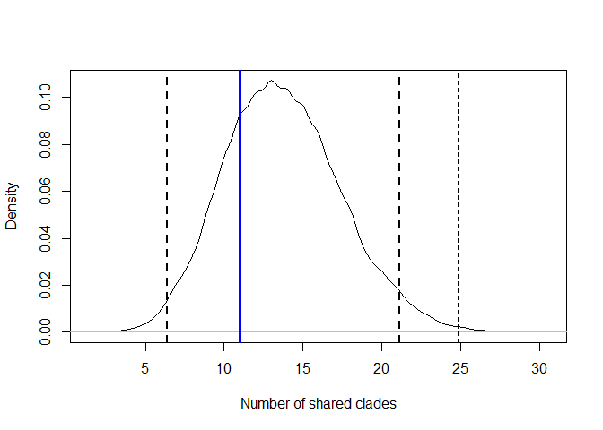

The neighbor-joining endosymbiont tree also shares 11 clades with the
host tree – we similarly cannot reject our null hypothesis.

Now we’ll test perform this test with other types of randomly generated
trees (`rtree()` and `treesim()`) to see if we get similar results.

Using treesim to generate the random trees. The parameters I used for
building the `treesim()` trees are those used in the help function. I
also chose a random amount of starting individuals in each (invented for
the sake of building trees using this function) state.

``` r
number_overlapping_clades <- as.vector(NULL)
for (i in 1:10000){
  random_1<-(runif(1,0,1)*72)+1
  random_1<-round(random_1,0)
  random_2<-74-random_1
  temp_tree<-treesim(pars=c(0.1,0.1,0.05,0.05,0.1,0.1),N0=random_1,N1=random_2,sampling.f=c(1,1))
  temp_tree$tip.label<-dixid_tip_label_names
  temp_tree_clades <- simplify2array(lapply(GetTerminalDescendants(temp_tree), ConvertTipVectorToString))
  number_overlapping_clades[i] <- sum(temp_tree_clades %in% tree_clades)
}

plot(density(number_overlapping_clades),xlim=c(0,20),xlab="Number of shared clades",main="")
clade_sd<-sd(number_overlapping_clades)
abline(v=(mean(number_overlapping_clades))-2*clade_sd,lwd=2,lty=2)
abline(v=(mean(number_overlapping_clades))+2*clade_sd,lwd=2,lty=2)
abline(v=(mean(number_overlapping_clades))-3*clade_sd,lwd=1,lty=2)
abline(v=(mean(number_overlapping_clades))+3*clade_sd,lwd=1,lty=2)

abline(v=UPGMA_endosymbiont_tree_overlapping_clades,lwd=3,col="blue")
```

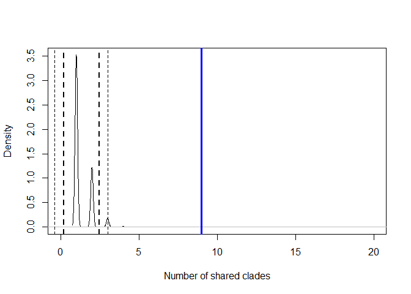

The number of shared clades between the UPGMA endosymbiont tree and the
host tree fall outside three standard deviations of the mean of the
number shared clades between the randomly-generated trees using the
treesim() function and the host tree. Therefore, we can reject our null
hypothesis that the number of shared clades between our host and UPGMA
endosymbiont trees is drawn from the distribution of shared clades
between our host and treesim-generated trees.

Because we’re using a tree generated using rtree() as our host tree, we
would expect our host tree to be different.

``` r
plot(density(number_overlapping_clades),xlim=c(0,12),xlab="Number of shared clades",main="")
abline(v=(mean(number_overlapping_clades))-2*clade_sd,lwd=2,lty=2)
abline(v=(mean(number_overlapping_clades))+2*clade_sd,lwd=2,lty=2)
abline(v=(mean(number_overlapping_clades))-3*clade_sd,lwd=1,lty=2)
abline(v=(mean(number_overlapping_clades))+3*clade_sd,lwd=1,lty=2)

abline(v=NJ_endosymbiont_tree_overlapping_clades,lwd=3,col="blue")
```

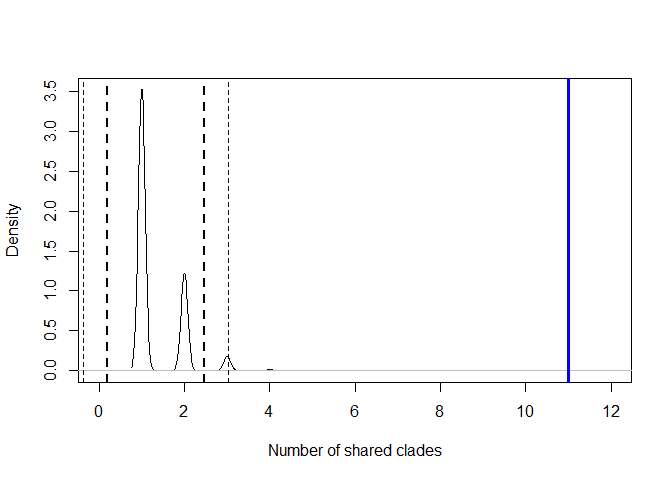

Because the number of shared clades between the host and NJ endosymbiont
trees is greater than 3 standard deviations from the mean of shared
clades between the host tree and treesim-generated trees, we can
simililary reject our null hypothesis that the number of shared clades
between our host and NJ endosymbiont trees is drawn from the
distribution of shared clades between our host and treesim-generated
trees.

Using rtree to generate random trees:

``` r
number_overlapping_clades <- as.vector(NULL)
for (i in 1:10000){
  temp_tree<-rtree(n=length(dixid_tip_label_names),rooted=TRUE,tip.label=dixid_tip_label_names)
  temp_tree_clades <- simplify2array(lapply(GetTerminalDescendants(temp_tree), ConvertTipVectorToString))
  number_overlapping_clades[i] <- sum(temp_tree_clades %in% tree_clades)
}

plot(density(number_overlapping_clades),xlab="Number of shared clades",main="")
clade_sd<-sd(number_overlapping_clades)
abline(v=(mean(number_overlapping_clades))-2*clade_sd,lwd=2,lty=2)
abline(v=(mean(number_overlapping_clades))+2*clade_sd,lwd=2,lty=2)
abline(v=(mean(number_overlapping_clades))-3*clade_sd,lwd=1,lty=2)
abline(v=(mean(number_overlapping_clades))+3*clade_sd,lwd=1,lty=2)

abline(v=UPGMA_endosymbiont_tree_overlapping_clades,lwd=3,col="blue")
```

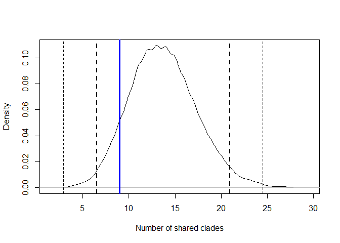

``` r
plot(density(number_overlapping_clades),xlab="Number of shared clades",main="")
abline(v=(mean(number_overlapping_clades))-2*clade_sd,lwd=2,lty=2)
abline(v=(mean(number_overlapping_clades))+2*clade_sd,lwd=2,lty=2)
abline(v=(mean(number_overlapping_clades))-3*clade_sd,lwd=1,lty=2)
abline(v=(mean(number_overlapping_clades))+3*clade_sd,lwd=1,lty=2)

abline(v=NJ_endosymbiont_tree_overlapping_clades,lwd=3,col="blue")
```

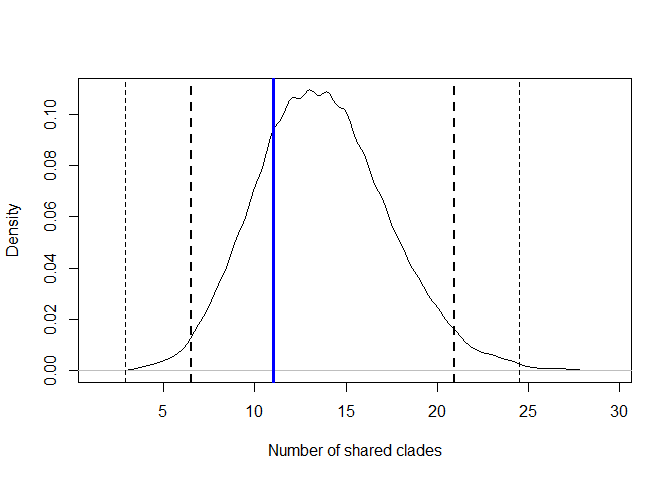

Our results of this test (and even the distribution generated) using
`rtree()` are the same as using `rcoal()`.

Since the UPGMA and NJ trees share the exact same number of clades (11)
with our host tree, are the clades they share the same ones?

For the UPGMA endosymbiont tree:

``` r
UPGMA_endosymbiont_tree_shared_clades<- which(UPGMA_endosymbiont_tree_clades %in% tree_clades)
NJ_endosymbiont_tree_shared_clades<- which(NJ_endosymbiont_tree_clades %in% tree_clades)

UPGMA_shared_clades_pair<-(UPGMA_endosymbiont_tree_clades[UPGMA_endosymbiont_tree_shared_clades])
node_label_vec_UPGMA<-as.vector(NULL)
for (i in 1:length(UPGMA_shared_clades_pair)){
  
  temp_clade_vec<-as.numeric(unlist(strsplit(UPGMA_shared_clades_pair[i],"_")))
  temp_node_labels<-as.vector(NULL)
  
  for (j in 1:length(temp_clade_vec)){
    
    temp_node_labels[j]<-attr(((Descendants(UPGMA_endosymbiont_tree))),"labels")[temp_clade_vec[j]]
    temp_node_labels<-paste(temp_node_labels,collapse="_")
    
  }
  cat(temp_node_labels)
  node_label_vec_UPGMA<-append(node_label_vec_UPGMA,temp_node_labels,after=1)
}
```

    ## tasmanica_71_yamatona_72_NA_fuscinervis_69_NA_NA_pullogruma_84_NA_NA_NA_ColombiaSm_70_NA_NA_NA_NA_CorsicaSp4_77_NA_NA_NA_NA_NA_Corsica_sp3_87_NA_NA_NA_NA_NA_NA_AsiodixaMalaysia_73_NA_NA_NA_NA_NA_NA_NA_Bittclav_23_NA_NA_NA_NA_NA_NA_NA_NA_ChilS_NA_NA_NA_NA_NA_NA_NA_NA_NA_DindianaS_45_NA_NA_NA_NA_NA_NA_NA_NA_NA_NA_Dixa_Suction_Cup_120_NA_NA_NA_NA_NA_NA_NA_NA_NA_NA_NA_Dixella_NWT-L2_95_NA_NA_NA_NA_NA_NA_NA_NA_NA_NA_NA_NA_Dlongistyla_31_NA_NA_NA_NA_NA_NA_NA_NA_NA_NA_NA_NA_NA_Dmaculata_68_NA_NA_NA_NA_NA_NA_NA_NA_NA_NA_NA_NA_NA_NA_Dmargin_30_NA_NA_NA_NA_NA_NA_NA_NA_NA_NA_NA_NA_NA_NA_NA_Dkatangae_12_NA_NA_NA_NA_NA_NA_NA_NA_NA_NA_NA_NA_NA_NA_NA_NA_Dterrapin_36_NA_NA_NA_NA_NA_NA_NA_NA_NA_NA_NA_NA_NA_NA_NA_NA_NA_Dtrilin_33_NA_NA_NA_NA_NA_NA_NA_NA_NA_NA_NA_NA_NA_NA_NA_NA_NA_NA_Marge_13_NA_NA_NA_NA_NA_NA_NA_NA_NA_NA_NA_NA_NA_NA_NA_NA_NA_NA_NA_Merxav_20_NA_NA_NA_NA_NA_NA_NA_NA_NA_NA_NA_NA_NA_NA_NA_NA_NA_NA_NA_NA_Dubiq_8_NA_NA_NA_NA_NA_NA_NA_NA_NA_NA_NA_NA_NA_NA_NA_NA_NA_NA_NA_NA_NA_DindianaGWA_1_NA_NA_NA_NA_NA_NA_NA_NA_NA_NA_NA_NA_NA_NA_NA_NA_NA_NA_NA_NA_NA_NA_NDCourt_10_NA_NA_NA_NA_NA_NA_NA_NA_NA_NA_NA_NA_NA_NA_NA_NA_NA_NA_NA_NA_NA_NA_NA_NDNZL_51_NA_NA_NA_NA_NA_NA_NA_NA_NA_NA_NA_NA_NA_NA_NA_NA_NA_NA_NA_NA_NA_NA_NA_NA_NDattrovitt_50_NA_NA_NA_NA_NA_NA_NA_NA_NA_NA_NA_NA_NA_NA_NA_NA_NA_NA_NA_NA_NA_NA_NA_NA_NA_Dfluvica_47_NA_NA_NA_NA_NA_NA_NA_NA_NA_NA_NA_NA_NA_NA_NA_NA_NA_NA_NA_NA_NA_NA_NA_NA_NA_NA_DindianaN_43_NA_NA_NA_NA_NA_NA_NA_NA_NA_NA_NA_NA_NA_NA_NA_NA_NA_NA_NA_NA_NA_NA_NA_NA_NA_NA_NA_DgermMidge_NA_NA_NA_NA_NA_NA_NA_NA_NA_NA_NA_NA_NA_NA_NA_NA_NA_NA_NA_NA_NA_NA_NA_NA_NA_NA_NA_NA_Dhegem_35_NA_NA_NA_NA_NA_NA_NA_NA_NA_NA_NA_NA_NA_NA_NA_NA_NA_NA_NA_NA_NA_NA_NA_NA_NA_NA_NA_NA_NA_DfuscaGWA_2_NA_NA_NA_NA_NA_NA_NA_NA_NA_NA_NA_NA_NA_NA_NA_NA_NA_NA_NA_NA_NA_NA_NA_NA_NA_NA_NA_NA_NA_NA_Dappalach_9_NA_NA_NA_NA_NA_NA_NA_NA_NA_NA_NA_NA_NA_NA_NA_NA_NA_NA_NA_NA_NA_NA_NA_NA_NA_NA_NA_NA_NA_NA_NA_Daurora_65_NA_NA_NA_NA_NA_NA_NA_NA_NA_NA_NA_NA_NA_NA_NA_NA_NA_NA_NA_NA_NA_NA_NA_NA_NA_NA_NA_NA_NA_NA_NA_NA_Drhath_26_NA_NA_NA_NA_NA_NA_NA_NA_NA_NA_NA_NA_NA_NA_NA_NA_NA_NA_NA_NA_NA_NA_NA_NA_NA_NA_NA_NA_NA_NA_NA_NA_NA_DrostrataMalay_63_NA_NA_NA_NA_NA_NA_NA_NA_NA_NA_NA_NA_NA_NA_NA_NA_NA_NA_NA_NA_NA_NA_NA_NA_NA_NA_NA_NA_NA_NA_NA_NA_NA_NA_Dblax_NA_NA_NA_NA_NA_NA_NA_NA_NA_NA_NA_NA_NA_NA_NA_NA_NA_NA_NA_NA_NA_NA_NA_NA_NA_NA_NA_NA_NA_NA_NA_NA_NA_NA_NA_repanda_85_NA_NA_NA_NA_NA_NA_NA_NA_NA_NA_NA_NA_NA_NA_NA_NA_NA_NA_NA_NA_NA_NA_NA_NA_NA_NA_NA_NA_NA_NA_NA_NA_NA_NA_NA_NA_Ddilatata_66_NA_NA_NA_NA_NA_NA_NA_NA_NA_NA_NA_NA_NA_NA_NA_NA_NA_NA_NA_NA_NA_NA_NA_NA_NA_NA_NA_NA_NA_NA_NA_NA_NA_NA_NA_NA_NA_Dpuget2_64_NA_NA_NA_NA_NA_NA_NA_NA_NA_NA_NA_NA_NA_NA_NA_NA_NA_NA_NA_NA_NA_NA_NA_NA_NA_NA_NA_NA_NA_NA_NA_NA_NA_NA_NA_NA_NA_NA_Dnigra_28_NA_NA_NA_NA_NA_NA_NA_NA_NA_NA_NA_NA_NA_NA_NA_NA_NA_NA_NA_NA_NA_NA_NA_NA_NA_NA_NA_NA_NA_NA_NA_NA_NA_NA_NA_NA_NA_NA_NA_Dnigrella_19_NA_NA_NA_NA_NA_NA_NA_NA_NA_NA_NA_NA_NA_NA_NA_NA_NA_NA_NA_NA_NA_NA_NA_NA_NA_NA_NA_NA_NA_NA_NA_NA_NA_NA_NA_NA_NA_NA_NA_NA_Dtern_NA_NA_NA_NA_NA_NA_NA_NA_NA_NA_NA_NA_NA_NA_NA_NA_NA_NA_NA_NA_NA_NA_NA_NA_NA_NA_NA_NA_NA_NA_NA_NA_NA_NA_NA_NA_NA_NA_NA_NA_NA_DternOLD_NA_NA_NA_NA_NA_NA_NA_NA_NA_NA_NA_NA_NA_NA_NA_NA_NA_NA_NA_NA_NA_NA_NA_NA_NA_NA_NA_NA_NA_NA_NA_NA_NA_NA_NA_NA_NA_NA_NA_NA_NA_NA_Dnova_4_NA_NA_NA_NA_NA_NA_NA_NA_NA_NA_NA_NA_NA_NA_NA_NA_NA_NA_NA_NA_NA_NA_NA_NA_NA_NA_NA_NA_NA_NA_NA_NA_NA_NA_NA_NA_NA_NA_NA_NA_NA_NA_NA_Dobscura_21_NA_NA_NA_NA_NA_NA_NA_NA_NA_NA_NA_NA_NA_NA_NA_NA_NA_NA_NA_NA_NA_NA_NA_NA_NA_NA_NA_NA_NA_NA_NA_NA_NA_NA_NA_NA_NA_NA_NA_NA_NA_NA_NA_NA_Ddistincta_39_NA_NA_NA_NA_NA_NA_NA_NA_NA_NA_NA_NA_NA_NA_NA_NA_NA_NA_NA_NA_NA_NA_NA_NA_NA_NA_NA_NA_NA_NA_NA_NA_NA_NA_NA_NA_NA_NA_NA_NA_NA_NA_NA_NA_NA_Ddyari_41_001_NA_NA_NA_NA_NA_NA_NA_NA_NA_NA_NA_NA_NA_NA_NA_NA_NA_NA_NA_NA_NA_NA_NA_NA_NA_NA_NA_NA_NA_NA_NA_NA_NA_NA_NA_NA_NA_NA_NA_NA_NA_NA_NA_NA_NA_NA_Dpuget_NA_NA_NA_NA_NA_NA_NA_NA_NA_NA_NA_NA_NA_NA_NA_NA_NA_NA_NA_NA_NA_NA_NA_NA_NA_NA_NA_NA_NA_NA_NA_NA_NA_NA_NA_NA_NA_NA_NA_NA_NA_NA_NA_NA_NA_NA_NA_PhuHin_27_NA_NA_NA_NA_NA_NA_NA_NA_NA_NA_NA_NA_NA_NA_NA_NA_NA_NA_NA_NA_NA_NA_NA_NA_NA_NA_NA_NA_NA_NA_NA_NA_NA_NA_NA_NA_NA_NA_NA_NA_NA_NA_NA_NA_NA_NA_NA_NA_Ptychquadr_24_NA_NA_NA_NA_NA_NA_NA_NA_NA_NA_NA_NA_NA_NA_NA_NA_NA_NA_NA_NA_NA_NA_NA_NA_NA_NA_NA_NA_NA_NA_NA_NA_NA_NA_NA_NA_NA_NA_NA_NA_NA_NA_NA_NA_NA_NA_NA_NA_NA_almota_86_NA_NA_NA_NA_NA_NA_NA_NA_NA_NA_NA_NA_NA_NA_NA_NA_NA_NA_NA_NA_NA_NA_NA_NA_NA_NA_NA_NA_NA_NA_NA_NA_NA_NA_NA_NA_NA_NA_NA_NA_NA_NA_NA_NA_NA_NA_NA_NA_NA_NA_NG_Brazil_119_NA_NA_NA_NA_NA_NA_NA_NA_NA_NA_NA_NA_NA_NA_NA_NA_NA_NA_NA_NA_NA_NA_NA_NA_NA_NA_NA_NA_NA_NA_NA_NA_NA_NA_NA_NA_NA_NA_NA_NA_NA_NA_NA_NA_NA_NA_NA_NA_NA_NA_NA_NZD_NA_NA_NA_NA_NA_NA_NA_NA_NA_NA_NA_NA_NA_NA_NA_NA_NA_NA_NA_NA_NA_NA_NA_NA_NA_NA_NA_NA_NA_NA_NA_NA_NA_NA_NA_NA_NA_NA_NA_NA_NA_NA_NA_NA_NA_NA_NA_NA_NA_NA_NA_NA_ParadCRANSTON_48_NA_NA_NA_NA_NA_NA_NA_NA_NA_NA_NA_NA_NA_NA_NA_NA_NA_NA_NA_NA_NA_NA_NA_NA_NA_NA_NA_NA_NA_NA_NA_NA_NA_NA_NA_NA_NA_NA_NA_NA_NA_NA_NA_NA_NA_NA_NA_NA_NA_NA_NA_NA_NA_attica_75_NA_NA_NA_NA_NA_NA_NA_NA_NA_NA_NA_NA_NA_NA_NA_NA_NA_NA_NA_NA_NA_NA_NA_NA_NA_NA_NA_NA_NA_NA_NA_NA_NA_NA_NA_NA_NA_NA_NA_NA_NA_NA_NA_NA_NA_NA_NA_NA_NA_NA_NA_NA_NA_NA_bicoloratum_74_NA_NA_NA_NA_NA_NA_NA_NA_NA_NA_NA_NA_NA_NA_NA_NA_NA_NA_NA_NA_NA_NA_NA_NA_NA_NA_NA_NA_NA_NA_NA_NA_NA_NA_NA_NA_NA_NA_NA_NA_NA_NA_NA_NA_NA_NA_NA_NA_NA_NA_NA_NA_NA_NA_NA_formosana_79_NA_NA_NA_NA_NA_NA_NA_NA_NA_NA_NA_NA_NA_NA_NA_NA_NA_NA_NA_NA_NA_NA_NA_NA_NA_NA_NA_NA_NA_NA_NA_NA_NA_NA_NA_NA_NA_NA_NA_NA_NA_NA_NA_NA_NA_NA_NA_NA_NA_NA_NA_NA_NA_NA_NA_NA_Dobtusa_29_NA_NA_NA_NA_NA_NA_NA_NA_NA_NA_NA_NA_NA_NA_NA_NA_NA_NA_NA_NA_NA_NA_NA_NA_NA_NA_NA_NA_NA_NA_NA_NA_NA_NA_NA_NA_NA_NA_NA_NA_NA_NA_NA_NA_NA_NA_NA_NA_NA_NA_NA_NA_NA_NA_NA_NA_NA_DoiInthKamtok_22_NA_NA_NA_NA_NA_NA_NA_NA_NA_NA_NA_NA_NA_NA_NA_NA_NA_NA_NA_NA_NA_NA_NA_NA_NA_NA_NA_NA_NA_NA_NA_NA_NA_NA_NA_NA_NA_NA_NA_NA_NA_NA_NA_NA_NA_NA_NA_NA_NA_NA_NA_NA_NA_NA_NA_NA_NA_NA_Dpseudind_18_NA_NA_NA_NA_NA_NA_NA_NA_NA_NA_NA_NA_NA_NA_NA_NA_NA_NA_NA_NA_NA_NA_NA_NA_NA_NA_NA_NA_NA_NA_NA_NA_NA_NA_NA_NA_NA_NA_NA_NA_NA_NA_NA_NA_NA_NA_NA_NA_NA_NA_NA_NA_NA_NA_NA_NA_NA_NA_NA_Dpycta_40_NA_NA_NA_NA_NA_NA_NA_NA_NA_NA_NA_NA_NA_NA_NA_NA_NA_NA_NA_NA_NA_NA_NA_NA_NA_NA_NA_NA_NA_NA_NA_NA_NA_NA_NA_NA_NA_NA_NA_NA_NA_NA_NA_NA_NA_NA_NA_NA_NA_NA_NA_NA_NA_NA_NA_NA_NA_NA_NA_NA_Dratch_NA_NA_NA_NA_NA_NA_NA_NA_NA_NA_NA_NA_NA_NA_NA_NA_NA_NA_NA_NA_NA_NA_NA_NA_NA_NA_NA_NA_NA_NA_NA_NA_NA_NA_NA_NA_NA_NA_NA_NA_NA_NA_NA_NA_NA_NA_NA_NA_NA_NA_NA_NA_NA_NA_NA_NA_NA_NA_NA_NA_NA_Drudis_14_NA_NA_NA_NA_NA_NA_NA_NA_NA_NA_NA_NA_NA_NA_NA_NA_NA_NA_NA_NA_NA_NA_NA_NA_NA_NA_NA_NA_NA_NA_NA_NA_NA_NA_NA_NA_NA_NA_NA_NA_NA_NA_NA_NA_NA_NA_NA_NA_NA_NA_NA_NA_NA_NA_NA_NA_NA_NA_NA_NA_NA_NA_Dalic_NA_NA_NA_NA_NA_NA_NA_NA_NA_NA_NA_NA_NA_NA_NA_NA_NA_NA_NA_NA_NA_NA_NA_NA_NA_NA_NA_NA_NA_NA_NA_NA_NA_NA_NA_NA_NA_NA_NA_NA_NA_NA_NA_NA_NA_NA_NA_NA_NA_NA_NA_NA_NA_NA_NA_NA_NA_NA_NA_NA_NA_NA_NA_Dalic2_49_NA_NA_NA_NA_NA_NA_NA_NA_NA_NA_NA_NA_NA_NA_NA_NA_NA_NA_NA_NA_NA_NA_NA_NA_NA_NA_NA_NA_NA_NA_NA_NA_NA_NA_NA_NA_NA_NA_NA_NA_NA_NA_NA_NA_NA_NA_NA_NA_NA_NA_NA_NA_NA_NA_NA_NA_NA_NA_NA_NA_NA_NA_NA_NA_DBPn_42_NA_NA_NA_NA_NA_NA_NA_NA_NA_NA_NA_NA_NA_NA_NA_NA_NA_NA_NA_NA_NA_NA_NA_NA_NA_NA_NA_NA_NA_NA_NA_NA_NA_NA_NA_NA_NA_NA_NA_NA_NA_NA_NA_NA_NA_NA_NA_NA_NA_NA_NA_NA_NA_NA_NA_NA_NA_NA_NA_NA_NA_NA_NA_NA_NA_Daestiv_32_NA_NA_NA_NA_NA_NA_NA_NA_NA_NA_NA_NA_NA_NA_NA_NA_NA_NA_NA_NA_NA_NA_NA_NA_NA_NA_NA_NA_NA_NA_NA_NA_NA_NA_NA_NA_NA_NA_NA_NA_NA_NA_NA_NA_NA_NA_NA_NA_NA_NA_NA_NA_NA_NA_NA_NA_NA_NA_NA_NA_NA_NA_NA_NA_NA_NA_Dcalif_5_NA_NA_NA_NA_NA_NA_NA_NA_NA_NA_NA_NA_NA_NA_NA_NA_NA_NA_NA_NA_NA_NA_NA_NA_NA_NA_NA_NA_NA_NA_NA_NA_NA_NA_NA_NA_NA_NA_NA_NA_NA_NA_NA_NA_NA_NA_NA_NA_NA_NA_NA_NA_NA_NA_NA_NA_NA_NA_NA_NA_NA_NA_NA_NA_NA_NA_NA_DcornWASA_52_NA_NA_NA_NA_NA_NA_NA_NA_NA_NA_NA_NA_NA_NA_NA_NA_NA_NA_NA_NA_NA_NA_NA_NA_NA_NA_NA_NA_NA_NA_NA_NA_NA_NA_NA_NA_NA_NA_NA_NA_NA_NA_NA_NA_NA_NA_NA_NA_NA_NA_NA_NA_NA_NA_NA_NA_NA_NA_NA_NA_NA_NA_NA_NA_NA_NA_NA_NA_Dshannoni_17_NA_NA_NA_NA_NA_NA_NA_NA_NA_NA_NA_NA_NA_NA_NA_NA_NA_NA_NA_NA_NA_NA_NA_NA_NA_NA_NA_NA_NA_NA_NA_NA_NA_NA_NA_NA_NA_NA_NA_NA_NA_NA_NA_NA_NA_NA_NA_NA_NA_NA_NA_NA_NA_NA_NA_NA_NA_NA_NA_NA_NA_NA_NA_NA_NA_NA_NA_NA_NA_Dsubmac_37_NA_NA_NA_NA_NA_NA_NA_NA_NA_NA_NA_NA_NA_NA_NA_NA_NA_NA_NA_NA_NA_NA_NA_NA_NA_NA_NA_NA_NA_NA_NA_NA_NA_NA_NA_NA_NA_NA_NA_NA_NA_NA_NA_NA_NA_NA_NA_NA_NA_NA_NA_NA_NA_NA_NA_NA_NA_NA_NA_NA_NA_NA_NA_NA_NA_NA_NA_NA_NA_NA_Dsubobsc_38_NA_NA_NA_NA_NA_NA_NA_NA_NA_NA_NA_NA_NA_NA_NA_NA_NA_NA_NA_NA_NA_NA_NA_NA_NA_NA_NA_NA_NA_NA_NA_NA_NA_NA_NA_NA_NA_NA_NA_NA_NA_NA_NA_NA_NA_NA_NA_NA_NA_NA_NA_NA_NA_NA_NA_NA_NA_NA_NA_NA_NA_NA_NA_NA_NA_NA_NA_NA_NA_NA_NA_Dtechana_34_NA_NA_NA_NA_NA_NA_NA_NA_NA_NA_NA_NA_NA_NA_NA_NA_NA_NA_NA_NA_NA_NA_NA_NA_NA_NA_NA_NA_NA_NA_NA_NA_NA_NA_NA_NA_NA_NA_NA_NA_NA_NA_NA_NA_NA_NA_NA_NA_NA_NA_NA_NA_NA_NA_NA_NA_NA_NA_NA_NA_NA_NA_NA_NA_NA_NA_NA_NA_NA_NA_NA_NA_Dsimilis_15tasmanica_71_yamatona_72DgermMidge_Dhegem_35Ddistincta_39_Ddyari_41_001NG_Brazil_119_NZD_NA_ParadCRANSTON_48Dpycta_40_Dratch_NA_Drudis_14Dpycta_40_DratchDBPn_42_Daestiv_32Dcalif_5_DcornWASA_52

``` r
node_label_vec_UPGMA
```

    ## [1] "tasmanica_71_yamatona_72_NA_fuscinervis_69_NA_NA_pullogruma_84_NA_NA_NA_ColombiaSm_70_NA_NA_NA_NA_CorsicaSp4_77_NA_NA_NA_NA_NA_Corsica_sp3_87_NA_NA_NA_NA_NA_NA_AsiodixaMalaysia_73_NA_NA_NA_NA_NA_NA_NA_Bittclav_23_NA_NA_NA_NA_NA_NA_NA_NA_ChilS_NA_NA_NA_NA_NA_NA_NA_NA_NA_DindianaS_45_NA_NA_NA_NA_NA_NA_NA_NA_NA_NA_Dixa_Suction_Cup_120_NA_NA_NA_NA_NA_NA_NA_NA_NA_NA_NA_Dixella_NWT-L2_95_NA_NA_NA_NA_NA_NA_NA_NA_NA_NA_NA_NA_Dlongistyla_31_NA_NA_NA_NA_NA_NA_NA_NA_NA_NA_NA_NA_NA_Dmaculata_68_NA_NA_NA_NA_NA_NA_NA_NA_NA_NA_NA_NA_NA_NA_Dmargin_30_NA_NA_NA_NA_NA_NA_NA_NA_NA_NA_NA_NA_NA_NA_NA_Dkatangae_12_NA_NA_NA_NA_NA_NA_NA_NA_NA_NA_NA_NA_NA_NA_NA_NA_Dterrapin_36_NA_NA_NA_NA_NA_NA_NA_NA_NA_NA_NA_NA_NA_NA_NA_NA_NA_Dtrilin_33_NA_NA_NA_NA_NA_NA_NA_NA_NA_NA_NA_NA_NA_NA_NA_NA_NA_NA_Marge_13_NA_NA_NA_NA_NA_NA_NA_NA_NA_NA_NA_NA_NA_NA_NA_NA_NA_NA_NA_Merxav_20_NA_NA_NA_NA_NA_NA_NA_NA_NA_NA_NA_NA_NA_NA_NA_NA_NA_NA_NA_NA_Dubiq_8_NA_NA_NA_NA_NA_NA_NA_NA_NA_NA_NA_NA_NA_NA_NA_NA_NA_NA_NA_NA_NA_DindianaGWA_1_NA_NA_NA_NA_NA_NA_NA_NA_NA_NA_NA_NA_NA_NA_NA_NA_NA_NA_NA_NA_NA_NA_NDCourt_10_NA_NA_NA_NA_NA_NA_NA_NA_NA_NA_NA_NA_NA_NA_NA_NA_NA_NA_NA_NA_NA_NA_NA_NDNZL_51_NA_NA_NA_NA_NA_NA_NA_NA_NA_NA_NA_NA_NA_NA_NA_NA_NA_NA_NA_NA_NA_NA_NA_NA_NDattrovitt_50_NA_NA_NA_NA_NA_NA_NA_NA_NA_NA_NA_NA_NA_NA_NA_NA_NA_NA_NA_NA_NA_NA_NA_NA_NA_Dfluvica_47_NA_NA_NA_NA_NA_NA_NA_NA_NA_NA_NA_NA_NA_NA_NA_NA_NA_NA_NA_NA_NA_NA_NA_NA_NA_NA_DindianaN_43_NA_NA_NA_NA_NA_NA_NA_NA_NA_NA_NA_NA_NA_NA_NA_NA_NA_NA_NA_NA_NA_NA_NA_NA_NA_NA_NA_DgermMidge_NA_NA_NA_NA_NA_NA_NA_NA_NA_NA_NA_NA_NA_NA_NA_NA_NA_NA_NA_NA_NA_NA_NA_NA_NA_NA_NA_NA_Dhegem_35_NA_NA_NA_NA_NA_NA_NA_NA_NA_NA_NA_NA_NA_NA_NA_NA_NA_NA_NA_NA_NA_NA_NA_NA_NA_NA_NA_NA_NA_DfuscaGWA_2_NA_NA_NA_NA_NA_NA_NA_NA_NA_NA_NA_NA_NA_NA_NA_NA_NA_NA_NA_NA_NA_NA_NA_NA_NA_NA_NA_NA_NA_NA_Dappalach_9_NA_NA_NA_NA_NA_NA_NA_NA_NA_NA_NA_NA_NA_NA_NA_NA_NA_NA_NA_NA_NA_NA_NA_NA_NA_NA_NA_NA_NA_NA_NA_Daurora_65_NA_NA_NA_NA_NA_NA_NA_NA_NA_NA_NA_NA_NA_NA_NA_NA_NA_NA_NA_NA_NA_NA_NA_NA_NA_NA_NA_NA_NA_NA_NA_NA_Drhath_26_NA_NA_NA_NA_NA_NA_NA_NA_NA_NA_NA_NA_NA_NA_NA_NA_NA_NA_NA_NA_NA_NA_NA_NA_NA_NA_NA_NA_NA_NA_NA_NA_NA_DrostrataMalay_63_NA_NA_NA_NA_NA_NA_NA_NA_NA_NA_NA_NA_NA_NA_NA_NA_NA_NA_NA_NA_NA_NA_NA_NA_NA_NA_NA_NA_NA_NA_NA_NA_NA_NA_Dblax_NA_NA_NA_NA_NA_NA_NA_NA_NA_NA_NA_NA_NA_NA_NA_NA_NA_NA_NA_NA_NA_NA_NA_NA_NA_NA_NA_NA_NA_NA_NA_NA_NA_NA_NA_repanda_85_NA_NA_NA_NA_NA_NA_NA_NA_NA_NA_NA_NA_NA_NA_NA_NA_NA_NA_NA_NA_NA_NA_NA_NA_NA_NA_NA_NA_NA_NA_NA_NA_NA_NA_NA_NA_Ddilatata_66_NA_NA_NA_NA_NA_NA_NA_NA_NA_NA_NA_NA_NA_NA_NA_NA_NA_NA_NA_NA_NA_NA_NA_NA_NA_NA_NA_NA_NA_NA_NA_NA_NA_NA_NA_NA_NA_Dpuget2_64_NA_NA_NA_NA_NA_NA_NA_NA_NA_NA_NA_NA_NA_NA_NA_NA_NA_NA_NA_NA_NA_NA_NA_NA_NA_NA_NA_NA_NA_NA_NA_NA_NA_NA_NA_NA_NA_NA_Dnigra_28_NA_NA_NA_NA_NA_NA_NA_NA_NA_NA_NA_NA_NA_NA_NA_NA_NA_NA_NA_NA_NA_NA_NA_NA_NA_NA_NA_NA_NA_NA_NA_NA_NA_NA_NA_NA_NA_NA_NA_Dnigrella_19_NA_NA_NA_NA_NA_NA_NA_NA_NA_NA_NA_NA_NA_NA_NA_NA_NA_NA_NA_NA_NA_NA_NA_NA_NA_NA_NA_NA_NA_NA_NA_NA_NA_NA_NA_NA_NA_NA_NA_NA_Dtern_NA_NA_NA_NA_NA_NA_NA_NA_NA_NA_NA_NA_NA_NA_NA_NA_NA_NA_NA_NA_NA_NA_NA_NA_NA_NA_NA_NA_NA_NA_NA_NA_NA_NA_NA_NA_NA_NA_NA_NA_NA_DternOLD_NA_NA_NA_NA_NA_NA_NA_NA_NA_NA_NA_NA_NA_NA_NA_NA_NA_NA_NA_NA_NA_NA_NA_NA_NA_NA_NA_NA_NA_NA_NA_NA_NA_NA_NA_NA_NA_NA_NA_NA_NA_NA_Dnova_4_NA_NA_NA_NA_NA_NA_NA_NA_NA_NA_NA_NA_NA_NA_NA_NA_NA_NA_NA_NA_NA_NA_NA_NA_NA_NA_NA_NA_NA_NA_NA_NA_NA_NA_NA_NA_NA_NA_NA_NA_NA_NA_NA_Dobscura_21_NA_NA_NA_NA_NA_NA_NA_NA_NA_NA_NA_NA_NA_NA_NA_NA_NA_NA_NA_NA_NA_NA_NA_NA_NA_NA_NA_NA_NA_NA_NA_NA_NA_NA_NA_NA_NA_NA_NA_NA_NA_NA_NA_NA_Ddistincta_39_NA_NA_NA_NA_NA_NA_NA_NA_NA_NA_NA_NA_NA_NA_NA_NA_NA_NA_NA_NA_NA_NA_NA_NA_NA_NA_NA_NA_NA_NA_NA_NA_NA_NA_NA_NA_NA_NA_NA_NA_NA_NA_NA_NA_NA_Ddyari_41_001_NA_NA_NA_NA_NA_NA_NA_NA_NA_NA_NA_NA_NA_NA_NA_NA_NA_NA_NA_NA_NA_NA_NA_NA_NA_NA_NA_NA_NA_NA_NA_NA_NA_NA_NA_NA_NA_NA_NA_NA_NA_NA_NA_NA_NA_NA_Dpuget_NA_NA_NA_NA_NA_NA_NA_NA_NA_NA_NA_NA_NA_NA_NA_NA_NA_NA_NA_NA_NA_NA_NA_NA_NA_NA_NA_NA_NA_NA_NA_NA_NA_NA_NA_NA_NA_NA_NA_NA_NA_NA_NA_NA_NA_NA_NA_PhuHin_27_NA_NA_NA_NA_NA_NA_NA_NA_NA_NA_NA_NA_NA_NA_NA_NA_NA_NA_NA_NA_NA_NA_NA_NA_NA_NA_NA_NA_NA_NA_NA_NA_NA_NA_NA_NA_NA_NA_NA_NA_NA_NA_NA_NA_NA_NA_NA_NA_Ptychquadr_24_NA_NA_NA_NA_NA_NA_NA_NA_NA_NA_NA_NA_NA_NA_NA_NA_NA_NA_NA_NA_NA_NA_NA_NA_NA_NA_NA_NA_NA_NA_NA_NA_NA_NA_NA_NA_NA_NA_NA_NA_NA_NA_NA_NA_NA_NA_NA_NA_NA_almota_86_NA_NA_NA_NA_NA_NA_NA_NA_NA_NA_NA_NA_NA_NA_NA_NA_NA_NA_NA_NA_NA_NA_NA_NA_NA_NA_NA_NA_NA_NA_NA_NA_NA_NA_NA_NA_NA_NA_NA_NA_NA_NA_NA_NA_NA_NA_NA_NA_NA_NA_NG_Brazil_119_NA_NA_NA_NA_NA_NA_NA_NA_NA_NA_NA_NA_NA_NA_NA_NA_NA_NA_NA_NA_NA_NA_NA_NA_NA_NA_NA_NA_NA_NA_NA_NA_NA_NA_NA_NA_NA_NA_NA_NA_NA_NA_NA_NA_NA_NA_NA_NA_NA_NA_NA_NZD_NA_NA_NA_NA_NA_NA_NA_NA_NA_NA_NA_NA_NA_NA_NA_NA_NA_NA_NA_NA_NA_NA_NA_NA_NA_NA_NA_NA_NA_NA_NA_NA_NA_NA_NA_NA_NA_NA_NA_NA_NA_NA_NA_NA_NA_NA_NA_NA_NA_NA_NA_NA_ParadCRANSTON_48_NA_NA_NA_NA_NA_NA_NA_NA_NA_NA_NA_NA_NA_NA_NA_NA_NA_NA_NA_NA_NA_NA_NA_NA_NA_NA_NA_NA_NA_NA_NA_NA_NA_NA_NA_NA_NA_NA_NA_NA_NA_NA_NA_NA_NA_NA_NA_NA_NA_NA_NA_NA_NA_attica_75_NA_NA_NA_NA_NA_NA_NA_NA_NA_NA_NA_NA_NA_NA_NA_NA_NA_NA_NA_NA_NA_NA_NA_NA_NA_NA_NA_NA_NA_NA_NA_NA_NA_NA_NA_NA_NA_NA_NA_NA_NA_NA_NA_NA_NA_NA_NA_NA_NA_NA_NA_NA_NA_NA_bicoloratum_74_NA_NA_NA_NA_NA_NA_NA_NA_NA_NA_NA_NA_NA_NA_NA_NA_NA_NA_NA_NA_NA_NA_NA_NA_NA_NA_NA_NA_NA_NA_NA_NA_NA_NA_NA_NA_NA_NA_NA_NA_NA_NA_NA_NA_NA_NA_NA_NA_NA_NA_NA_NA_NA_NA_NA_formosana_79_NA_NA_NA_NA_NA_NA_NA_NA_NA_NA_NA_NA_NA_NA_NA_NA_NA_NA_NA_NA_NA_NA_NA_NA_NA_NA_NA_NA_NA_NA_NA_NA_NA_NA_NA_NA_NA_NA_NA_NA_NA_NA_NA_NA_NA_NA_NA_NA_NA_NA_NA_NA_NA_NA_NA_NA_Dobtusa_29_NA_NA_NA_NA_NA_NA_NA_NA_NA_NA_NA_NA_NA_NA_NA_NA_NA_NA_NA_NA_NA_NA_NA_NA_NA_NA_NA_NA_NA_NA_NA_NA_NA_NA_NA_NA_NA_NA_NA_NA_NA_NA_NA_NA_NA_NA_NA_NA_NA_NA_NA_NA_NA_NA_NA_NA_NA_DoiInthKamtok_22_NA_NA_NA_NA_NA_NA_NA_NA_NA_NA_NA_NA_NA_NA_NA_NA_NA_NA_NA_NA_NA_NA_NA_NA_NA_NA_NA_NA_NA_NA_NA_NA_NA_NA_NA_NA_NA_NA_NA_NA_NA_NA_NA_NA_NA_NA_NA_NA_NA_NA_NA_NA_NA_NA_NA_NA_NA_NA_Dpseudind_18_NA_NA_NA_NA_NA_NA_NA_NA_NA_NA_NA_NA_NA_NA_NA_NA_NA_NA_NA_NA_NA_NA_NA_NA_NA_NA_NA_NA_NA_NA_NA_NA_NA_NA_NA_NA_NA_NA_NA_NA_NA_NA_NA_NA_NA_NA_NA_NA_NA_NA_NA_NA_NA_NA_NA_NA_NA_NA_NA_Dpycta_40_NA_NA_NA_NA_NA_NA_NA_NA_NA_NA_NA_NA_NA_NA_NA_NA_NA_NA_NA_NA_NA_NA_NA_NA_NA_NA_NA_NA_NA_NA_NA_NA_NA_NA_NA_NA_NA_NA_NA_NA_NA_NA_NA_NA_NA_NA_NA_NA_NA_NA_NA_NA_NA_NA_NA_NA_NA_NA_NA_NA_Dratch_NA_NA_NA_NA_NA_NA_NA_NA_NA_NA_NA_NA_NA_NA_NA_NA_NA_NA_NA_NA_NA_NA_NA_NA_NA_NA_NA_NA_NA_NA_NA_NA_NA_NA_NA_NA_NA_NA_NA_NA_NA_NA_NA_NA_NA_NA_NA_NA_NA_NA_NA_NA_NA_NA_NA_NA_NA_NA_NA_NA_NA_Drudis_14_NA_NA_NA_NA_NA_NA_NA_NA_NA_NA_NA_NA_NA_NA_NA_NA_NA_NA_NA_NA_NA_NA_NA_NA_NA_NA_NA_NA_NA_NA_NA_NA_NA_NA_NA_NA_NA_NA_NA_NA_NA_NA_NA_NA_NA_NA_NA_NA_NA_NA_NA_NA_NA_NA_NA_NA_NA_NA_NA_NA_NA_NA_Dalic_NA_NA_NA_NA_NA_NA_NA_NA_NA_NA_NA_NA_NA_NA_NA_NA_NA_NA_NA_NA_NA_NA_NA_NA_NA_NA_NA_NA_NA_NA_NA_NA_NA_NA_NA_NA_NA_NA_NA_NA_NA_NA_NA_NA_NA_NA_NA_NA_NA_NA_NA_NA_NA_NA_NA_NA_NA_NA_NA_NA_NA_NA_NA_Dalic2_49_NA_NA_NA_NA_NA_NA_NA_NA_NA_NA_NA_NA_NA_NA_NA_NA_NA_NA_NA_NA_NA_NA_NA_NA_NA_NA_NA_NA_NA_NA_NA_NA_NA_NA_NA_NA_NA_NA_NA_NA_NA_NA_NA_NA_NA_NA_NA_NA_NA_NA_NA_NA_NA_NA_NA_NA_NA_NA_NA_NA_NA_NA_NA_NA_DBPn_42_NA_NA_NA_NA_NA_NA_NA_NA_NA_NA_NA_NA_NA_NA_NA_NA_NA_NA_NA_NA_NA_NA_NA_NA_NA_NA_NA_NA_NA_NA_NA_NA_NA_NA_NA_NA_NA_NA_NA_NA_NA_NA_NA_NA_NA_NA_NA_NA_NA_NA_NA_NA_NA_NA_NA_NA_NA_NA_NA_NA_NA_NA_NA_NA_NA_Daestiv_32_NA_NA_NA_NA_NA_NA_NA_NA_NA_NA_NA_NA_NA_NA_NA_NA_NA_NA_NA_NA_NA_NA_NA_NA_NA_NA_NA_NA_NA_NA_NA_NA_NA_NA_NA_NA_NA_NA_NA_NA_NA_NA_NA_NA_NA_NA_NA_NA_NA_NA_NA_NA_NA_NA_NA_NA_NA_NA_NA_NA_NA_NA_NA_NA_NA_NA_Dcalif_5_NA_NA_NA_NA_NA_NA_NA_NA_NA_NA_NA_NA_NA_NA_NA_NA_NA_NA_NA_NA_NA_NA_NA_NA_NA_NA_NA_NA_NA_NA_NA_NA_NA_NA_NA_NA_NA_NA_NA_NA_NA_NA_NA_NA_NA_NA_NA_NA_NA_NA_NA_NA_NA_NA_NA_NA_NA_NA_NA_NA_NA_NA_NA_NA_NA_NA_NA_DcornWASA_52_NA_NA_NA_NA_NA_NA_NA_NA_NA_NA_NA_NA_NA_NA_NA_NA_NA_NA_NA_NA_NA_NA_NA_NA_NA_NA_NA_NA_NA_NA_NA_NA_NA_NA_NA_NA_NA_NA_NA_NA_NA_NA_NA_NA_NA_NA_NA_NA_NA_NA_NA_NA_NA_NA_NA_NA_NA_NA_NA_NA_NA_NA_NA_NA_NA_NA_NA_NA_Dshannoni_17_NA_NA_NA_NA_NA_NA_NA_NA_NA_NA_NA_NA_NA_NA_NA_NA_NA_NA_NA_NA_NA_NA_NA_NA_NA_NA_NA_NA_NA_NA_NA_NA_NA_NA_NA_NA_NA_NA_NA_NA_NA_NA_NA_NA_NA_NA_NA_NA_NA_NA_NA_NA_NA_NA_NA_NA_NA_NA_NA_NA_NA_NA_NA_NA_NA_NA_NA_NA_NA_Dsubmac_37_NA_NA_NA_NA_NA_NA_NA_NA_NA_NA_NA_NA_NA_NA_NA_NA_NA_NA_NA_NA_NA_NA_NA_NA_NA_NA_NA_NA_NA_NA_NA_NA_NA_NA_NA_NA_NA_NA_NA_NA_NA_NA_NA_NA_NA_NA_NA_NA_NA_NA_NA_NA_NA_NA_NA_NA_NA_NA_NA_NA_NA_NA_NA_NA_NA_NA_NA_NA_NA_NA_Dsubobsc_38_NA_NA_NA_NA_NA_NA_NA_NA_NA_NA_NA_NA_NA_NA_NA_NA_NA_NA_NA_NA_NA_NA_NA_NA_NA_NA_NA_NA_NA_NA_NA_NA_NA_NA_NA_NA_NA_NA_NA_NA_NA_NA_NA_NA_NA_NA_NA_NA_NA_NA_NA_NA_NA_NA_NA_NA_NA_NA_NA_NA_NA_NA_NA_NA_NA_NA_NA_NA_NA_NA_NA_Dtechana_34_NA_NA_NA_NA_NA_NA_NA_NA_NA_NA_NA_NA_NA_NA_NA_NA_NA_NA_NA_NA_NA_NA_NA_NA_NA_NA_NA_NA_NA_NA_NA_NA_NA_NA_NA_NA_NA_NA_NA_NA_NA_NA_NA_NA_NA_NA_NA_NA_NA_NA_NA_NA_NA_NA_NA_NA_NA_NA_NA_NA_NA_NA_NA_NA_NA_NA_NA_NA_NA_NA_NA_NA_Dsimilis_15"
    ## [2] "Dcalif_5_DcornWASA_52"                                                                                                                                                                                                                                                                                                                                                                                                                                                                                                                                                                                                                                                                                                                                                                                                                                                                                                                                                                                                                                                                                                                                                                                                                                                                                                                                                                                                                                                                                                                                                                                                                                                                                                                                                                                                                                                                                                                                                                                                                                                                                                                                                                                                                                                                                                                                                                                                                                                                                                                                                                                                                                                                                                                                                                                                                                                                                                                                                                                                                                                                                                                                                                                                                                                                                                                                                                                                                                                                                                                                                                                                                                                                                                                                                                                                                                                                                                                                                                                                                                                                                                                                                                                                                                                                                                                                                                                                                                                                                                                                                                                                                                                                                                                                                                                                                                                                                                                                                                                                                                                                                                                                                                                                                                                                                                                                                                                                                                                                                                                                                                                                                                                                                                                                                                                                                                                                                                                                                                                                                                                                                                                                                                                                                                                                                                                                                                                                                                                                                                                                                                                                                                                                                                                                                                                                                                                                                                                                                                                                                                                                                                                                                                                                                                                                                                                                                                                                                                                                                                                                                                                                                                                                                                                                                                                                                                                                                                                                                                                                                                                                                                                                                                                                                                                                                                                                                                                                                                                                                                                                                                                                                                                                                                                                                                                                                                                                                                                                                                                                                                                                                                
    ## [3] "DBPn_42_Daestiv_32"                                                                                                                                                                                                                                                                                                                                                                                                                                                                                                                                                                                                                                                                                                                                                                                                                                                                                                                                                                                                                                                                                                                                                                                                                                                                                                                                                                                                                                                                                                                                                                                                                                                                                                                                                                                                                                                                                                                                                                                                                                                                                                                                                                                                                                                                                                                                                                                                                                                                                                                                                                                                                                                                                                                                                                                                                                                                                                                                                                                                                                                                                                                                                                                                                                                                                                                                                                                                                                                                                                                                                                                                                                                                                                                                                                                                                                                                                                                                                                                                                                                                                                                                                                                                                                                                                                                                                                                                                                                                                                                                                                                                                                                                                                                                                                                                                                                                                                                                                                                                                                                                                                                                                                                                                                                                                                                                                                                                                                                                                                                                                                                                                                                                                                                                                                                                                                                                                                                                                                                                                                                                                                                                                                                                                                                                                                                                                                                                                                                                                                                                                                                                                                                                                                                                                                                                                                                                                                                                                                                                                                                                                                                                                                                                                                                                                                                                                                                                                                                                                                                                                                                                                                                                                                                                                                                                                                                                                                                                                                                                                                                                                                                                                                                                                                                                                                                                                                                                                                                                                                                                                                                                                                                                                                                                                                                                                                                                                                                                                                                                                                                                                                   
    ## [4] "Dpycta_40_Dratch"                                                                                                                                                                                                                                                                                                                                                                                                                                                                                                                                                                                                                                                                                                                                                                                                                                                                                                                                                                                                                                                                                                                                                                                                                                                                                                                                                                                                                                                                                                                                                                                                                                                                                                                                                                                                                                                                                                                                                                                                                                                                                                                                                                                                                                                                                                                                                                                                                                                                                                                                                                                                                                                                                                                                                                                                                                                                                                                                                                                                                                                                                                                                                                                                                                                                                                                                                                                                                                                                                                                                                                                                                                                                                                                                                                                                                                                                                                                                                                                                                                                                                                                                                                                                                                                                                                                                                                                                                                                                                                                                                                                                                                                                                                                                                                                                                                                                                                                                                                                                                                                                                                                                                                                                                                                                                                                                                                                                                                                                                                                                                                                                                                                                                                                                                                                                                                                                                                                                                                                                                                                                                                                                                                                                                                                                                                                                                                                                                                                                                                                                                                                                                                                                                                                                                                                                                                                                                                                                                                                                                                                                                                                                                                                                                                                                                                                                                                                                                                                                                                                                                                                                                                                                                                                                                                                                                                                                                                                                                                                                                                                                                                                                                                                                                                                                                                                                                                                                                                                                                                                                                                                                                                                                                                                                                                                                                                                                                                                                                                                                                                                                                                     
    ## [5] "Dpycta_40_Dratch_NA_Drudis_14"                                                                                                                                                                                                                                                                                                                                                                                                                                                                                                                                                                                                                                                                                                                                                                                                                                                                                                                                                                                                                                                                                                                                                                                                                                                                                                                                                                                                                                                                                                                                                                                                                                                                                                                                                                                                                                                                                                                                                                                                                                                                                                                                                                                                                                                                                                                                                                                                                                                                                                                                                                                                                                                                                                                                                                                                                                                                                                                                                                                                                                                                                                                                                                                                                                                                                                                                                                                                                                                                                                                                                                                                                                                                                                                                                                                                                                                                                                                                                                                                                                                                                                                                                                                                                                                                                                                                                                                                                                                                                                                                                                                                                                                                                                                                                                                                                                                                                                                                                                                                                                                                                                                                                                                                                                                                                                                                                                                                                                                                                                                                                                                                                                                                                                                                                                                                                                                                                                                                                                                                                                                                                                                                                                                                                                                                                                                                                                                                                                                                                                                                                                                                                                                                                                                                                                                                                                                                                                                                                                                                                                                                                                                                                                                                                                                                                                                                                                                                                                                                                                                                                                                                                                                                                                                                                                                                                                                                                                                                                                                                                                                                                                                                                                                                                                                                                                                                                                                                                                                                                                                                                                                                                                                                                                                                                                                                                                                                                                                                                                                                                                                                                        
    ## [6] "NG_Brazil_119_NZD_NA_ParadCRANSTON_48"                                                                                                                                                                                                                                                                                                                                                                                                                                                                                                                                                                                                                                                                                                                                                                                                                                                                                                                                                                                                                                                                                                                                                                                                                                                                                                                                                                                                                                                                                                                                                                                                                                                                                                                                                                                                                                                                                                                                                                                                                                                                                                                                                                                                                                                                                                                                                                                                                                                                                                                                                                                                                                                                                                                                                                                                                                                                                                                                                                                                                                                                                                                                                                                                                                                                                                                                                                                                                                                                                                                                                                                                                                                                                                                                                                                                                                                                                                                                                                                                                                                                                                                                                                                                                                                                                                                                                                                                                                                                                                                                                                                                                                                                                                                                                                                                                                                                                                                                                                                                                                                                                                                                                                                                                                                                                                                                                                                                                                                                                                                                                                                                                                                                                                                                                                                                                                                                                                                                                                                                                                                                                                                                                                                                                                                                                                                                                                                                                                                                                                                                                                                                                                                                                                                                                                                                                                                                                                                                                                                                                                                                                                                                                                                                                                                                                                                                                                                                                                                                                                                                                                                                                                                                                                                                                                                                                                                                                                                                                                                                                                                                                                                                                                                                                                                                                                                                                                                                                                                                                                                                                                                                                                                                                                                                                                                                                                                                                                                                                                                                                                                                                
    ## [7] "Ddistincta_39_Ddyari_41_001"                                                                                                                                                                                                                                                                                                                                                                                                                                                                                                                                                                                                                                                                                                                                                                                                                                                                                                                                                                                                                                                                                                                                                                                                                                                                                                                                                                                                                                                                                                                                                                                                                                                                                                                                                                                                                                                                                                                                                                                                                                                                                                                                                                                                                                                                                                                                                                                                                                                                                                                                                                                                                                                                                                                                                                                                                                                                                                                                                                                                                                                                                                                                                                                                                                                                                                                                                                                                                                                                                                                                                                                                                                                                                                                                                                                                                                                                                                                                                                                                                                                                                                                                                                                                                                                                                                                                                                                                                                                                                                                                                                                                                                                                                                                                                                                                                                                                                                                                                                                                                                                                                                                                                                                                                                                                                                                                                                                                                                                                                                                                                                                                                                                                                                                                                                                                                                                                                                                                                                                                                                                                                                                                                                                                                                                                                                                                                                                                                                                                                                                                                                                                                                                                                                                                                                                                                                                                                                                                                                                                                                                                                                                                                                                                                                                                                                                                                                                                                                                                                                                                                                                                                                                                                                                                                                                                                                                                                                                                                                                                                                                                                                                                                                                                                                                                                                                                                                                                                                                                                                                                                                                                                                                                                                                                                                                                                                                                                                                                                                                                                                                                                          
    ## [8] "DgermMidge_Dhegem_35"                                                                                                                                                                                                                                                                                                                                                                                                                                                                                                                                                                                                                                                                                                                                                                                                                                                                                                                                                                                                                                                                                                                                                                                                                                                                                                                                                                                                                                                                                                                                                                                                                                                                                                                                                                                                                                                                                                                                                                                                                                                                                                                                                                                                                                                                                                                                                                                                                                                                                                                                                                                                                                                                                                                                                                                                                                                                                                                                                                                                                                                                                                                                                                                                                                                                                                                                                                                                                                                                                                                                                                                                                                                                                                                                                                                                                                                                                                                                                                                                                                                                                                                                                                                                                                                                                                                                                                                                                                                                                                                                                                                                                                                                                                                                                                                                                                                                                                                                                                                                                                                                                                                                                                                                                                                                                                                                                                                                                                                                                                                                                                                                                                                                                                                                                                                                                                                                                                                                                                                                                                                                                                                                                                                                                                                                                                                                                                                                                                                                                                                                                                                                                                                                                                                                                                                                                                                                                                                                                                                                                                                                                                                                                                                                                                                                                                                                                                                                                                                                                                                                                                                                                                                                                                                                                                                                                                                                                                                                                                                                                                                                                                                                                                                                                                                                                                                                                                                                                                                                                                                                                                                                                                                                                                                                                                                                                                                                                                                                                                                                                                                                                                 
    ## [9] "tasmanica_71_yamatona_72"

Now for the neighbor-joining endosymbiont tree.

``` r
NJ_shared_clades_pair<-(NJ_endosymbiont_tree_clades[UPGMA_endosymbiont_tree_shared_clades])
node_label_vec_NJ<-as.vector(NULL)
for (i in 1:length(NJ_shared_clades_pair)){
  
  temp_clade_vec<-as.numeric(unlist(strsplit(NJ_shared_clades_pair[i],"_")))
  temp_node_labels<-as.vector(NULL)
  
  for (j in 1:length(temp_clade_vec)){
    
    temp_node_labels[j]<-attr(((Descendants(NJ_endosymbiont_tree))),"labels")[temp_clade_vec[j]]
    temp_node_labels<-paste(temp_node_labels,collapse="_")
    
  }
  cat(temp_node_labels)
  node_label_vec_NJ<-append(node_label_vec_NJ,temp_node_labels,after=1)
}
```

    ## DgermMidge_Dhegem_35_NA_DfuscaGWA_2_NA_NA_DindianaN_43_NA_NA_NA_Ddistincta_39_NA_NA_NA_NA_Ddyari_41_001_NA_NA_NA_NA_NA_Dfluvica_47_NA_NA_NA_NA_NA_NA_Dappalach_9_NA_NA_NA_NA_NA_NA_NA_Daurora_65_NA_NA_NA_NA_NA_NA_NA_NA_Drhath_26_NA_NA_NA_NA_NA_NA_NA_NA_NA_DrostrataMalay_63_NA_NA_NA_NA_NA_NA_NA_NA_NA_NA_Dblax_NA_NA_NA_NA_NA_NA_NA_NA_NA_NA_NA_Ddilatata_66_NA_NA_NA_NA_NA_NA_NA_NA_NA_NA_NA_NA_Dnigrella_19_NA_NA_NA_NA_NA_NA_NA_NA_NA_NA_NA_NA_NA_Dnigra_28_NA_NA_NA_NA_NA_NA_NA_NA_NA_NA_NA_NA_NA_NA_Dpuget2_64_NA_NA_NA_NA_NA_NA_NA_NA_NA_NA_NA_NA_NA_NA_NA_Dnova_4_NA_NA_NA_NA_NA_NA_NA_NA_NA_NA_NA_NA_NA_NA_NA_NA_Dobscura_21_NA_NA_NA_NA_NA_NA_NA_NA_NA_NA_NA_NA_NA_NA_NA_NA_NA_Dtern_NA_NA_NA_NA_NA_NA_NA_NA_NA_NA_NA_NA_NA_NA_NA_NA_NA_NA_DternOLD_NA_NA_NA_NA_NA_NA_NA_NA_NA_NA_NA_NA_NA_NA_NA_NA_NA_NA_NA_repanda_85_NA_NA_NA_NA_NA_NA_NA_NA_NA_NA_NA_NA_NA_NA_NA_NA_NA_NA_NA_NA_DindianaGWA_1_NA_NA_NA_NA_NA_NA_NA_NA_NA_NA_NA_NA_NA_NA_NA_NA_NA_NA_NA_NA_NA_Dtrilin_33_NA_NA_NA_NA_NA_NA_NA_NA_NA_NA_NA_NA_NA_NA_NA_NA_NA_NA_NA_NA_NA_NA_Dubiq_8_NA_NA_NA_NA_NA_NA_NA_NA_NA_NA_NA_NA_NA_NA_NA_NA_NA_NA_NA_NA_NA_NA_NA_Dterrapin_36_NA_NA_NA_NA_NA_NA_NA_NA_NA_NA_NA_NA_NA_NA_NA_NA_NA_NA_NA_NA_NA_NA_NA_NA_Marge_13_NA_NA_NA_NA_NA_NA_NA_NA_NA_NA_NA_NA_NA_NA_NA_NA_NA_NA_NA_NA_NA_NA_NA_NA_NA_Merxav_20_NA_NA_NA_NA_NA_NA_NA_NA_NA_NA_NA_NA_NA_NA_NA_NA_NA_NA_NA_NA_NA_NA_NA_NA_NA_NA_PhuHin_27_NA_NA_NA_NA_NA_NA_NA_NA_NA_NA_NA_NA_NA_NA_NA_NA_NA_NA_NA_NA_NA_NA_NA_NA_NA_NA_NA_Ptychquadr_24_NA_NA_NA_NA_NA_NA_NA_NA_NA_NA_NA_NA_NA_NA_NA_NA_NA_NA_NA_NA_NA_NA_NA_NA_NA_NA_NA_NA_almota_86_NA_NA_NA_NA_NA_NA_NA_NA_NA_NA_NA_NA_NA_NA_NA_NA_NA_NA_NA_NA_NA_NA_NA_NA_NA_NA_NA_NA_NA_NG_Brazil_119_NA_NA_NA_NA_NA_NA_NA_NA_NA_NA_NA_NA_NA_NA_NA_NA_NA_NA_NA_NA_NA_NA_NA_NA_NA_NA_NA_NA_NA_NA_NZD_NA_NA_NA_NA_NA_NA_NA_NA_NA_NA_NA_NA_NA_NA_NA_NA_NA_NA_NA_NA_NA_NA_NA_NA_NA_NA_NA_NA_NA_NA_NA_ParadCRANSTON_48_NA_NA_NA_NA_NA_NA_NA_NA_NA_NA_NA_NA_NA_NA_NA_NA_NA_NA_NA_NA_NA_NA_NA_NA_NA_NA_NA_NA_NA_NA_NA_NA_attica_75_NA_NA_NA_NA_NA_NA_NA_NA_NA_NA_NA_NA_NA_NA_NA_NA_NA_NA_NA_NA_NA_NA_NA_NA_NA_NA_NA_NA_NA_NA_NA_NA_NA_bicoloratum_74_NA_NA_NA_NA_NA_NA_NA_NA_NA_NA_NA_NA_NA_NA_NA_NA_NA_NA_NA_NA_NA_NA_NA_NA_NA_NA_NA_NA_NA_NA_NA_NA_NA_NA_formosana_79_NA_NA_NA_NA_NA_NA_NA_NA_NA_NA_NA_NA_NA_NA_NA_NA_NA_NA_NA_NA_NA_NA_NA_NA_NA_NA_NA_NA_NA_NA_NA_NA_NA_NA_NA_NDCourt_10_NA_NA_NA_NA_NA_NA_NA_NA_NA_NA_NA_NA_NA_NA_NA_NA_NA_NA_NA_NA_NA_NA_NA_NA_NA_NA_NA_NA_NA_NA_NA_NA_NA_NA_NA_NA_NDNZL_51_NA_NA_NA_NA_NA_NA_NA_NA_NA_NA_NA_NA_NA_NA_NA_NA_NA_NA_NA_NA_NA_NA_NA_NA_NA_NA_NA_NA_NA_NA_NA_NA_NA_NA_NA_NA_NA_NDattrovitt_50_NA_NA_NA_NA_NA_NA_NA_NA_NA_NA_NA_NA_NA_NA_NA_NA_NA_NA_NA_NA_NA_NA_NA_NA_NA_NA_NA_NA_NA_NA_NA_NA_NA_NA_NA_NA_NA_NA_Dpycta_40_NA_NA_NA_NA_NA_NA_NA_NA_NA_NA_NA_NA_NA_NA_NA_NA_NA_NA_NA_NA_NA_NA_NA_NA_NA_NA_NA_NA_NA_NA_NA_NA_NA_NA_NA_NA_NA_NA_NA_Drudis_14_NA_NA_NA_NA_NA_NA_NA_NA_NA_NA_NA_NA_NA_NA_NA_NA_NA_NA_NA_NA_NA_NA_NA_NA_NA_NA_NA_NA_NA_NA_NA_NA_NA_NA_NA_NA_NA_NA_NA_NA_Dratch_NA_NA_NA_NA_NA_NA_NA_NA_NA_NA_NA_NA_NA_NA_NA_NA_NA_NA_NA_NA_NA_NA_NA_NA_NA_NA_NA_NA_NA_NA_NA_NA_NA_NA_NA_NA_NA_NA_NA_NA_NA_DBPn_42_NA_NA_NA_NA_NA_NA_NA_NA_NA_NA_NA_NA_NA_NA_NA_NA_NA_NA_NA_NA_NA_NA_NA_NA_NA_NA_NA_NA_NA_NA_NA_NA_NA_NA_NA_NA_NA_NA_NA_NA_NA_NA_Daestiv_32_NA_NA_NA_NA_NA_NA_NA_NA_NA_NA_NA_NA_NA_NA_NA_NA_NA_NA_NA_NA_NA_NA_NA_NA_NA_NA_NA_NA_NA_NA_NA_NA_NA_NA_NA_NA_NA_NA_NA_NA_NA_NA_NA_Dalic_NA_NA_NA_NA_NA_NA_NA_NA_NA_NA_NA_NA_NA_NA_NA_NA_NA_NA_NA_NA_NA_NA_NA_NA_NA_NA_NA_NA_NA_NA_NA_NA_NA_NA_NA_NA_NA_NA_NA_NA_NA_NA_NA_NA_Dalic2_49_NA_NA_NA_NA_NA_NA_NA_NA_NA_NA_NA_NA_NA_NA_NA_NA_NA_NA_NA_NA_NA_NA_NA_NA_NA_NA_NA_NA_NA_NA_NA_NA_NA_NA_NA_NA_NA_NA_NA_NA_NA_NA_NA_NA_NA_Dcalif_5_NA_NA_NA_NA_NA_NA_NA_NA_NA_NA_NA_NA_NA_NA_NA_NA_NA_NA_NA_NA_NA_NA_NA_NA_NA_NA_NA_NA_NA_NA_NA_NA_NA_NA_NA_NA_NA_NA_NA_NA_NA_NA_NA_NA_NA_NA_DcornWASA_52_NA_NA_NA_NA_NA_NA_NA_NA_NA_NA_NA_NA_NA_NA_NA_NA_NA_NA_NA_NA_NA_NA_NA_NA_NA_NA_NA_NA_NA_NA_NA_NA_NA_NA_NA_NA_NA_NA_NA_NA_NA_NA_NA_NA_NA_NA_NA_Dshannoni_17_NA_NA_NA_NA_NA_NA_NA_NA_NA_NA_NA_NA_NA_NA_NA_NA_NA_NA_NA_NA_NA_NA_NA_NA_NA_NA_NA_NA_NA_NA_NA_NA_NA_NA_NA_NA_NA_NA_NA_NA_NA_NA_NA_NA_NA_NA_NA_NA_Dsubmac_37_NA_NA_NA_NA_NA_NA_NA_NA_NA_NA_NA_NA_NA_NA_NA_NA_NA_NA_NA_NA_NA_NA_NA_NA_NA_NA_NA_NA_NA_NA_NA_NA_NA_NA_NA_NA_NA_NA_NA_NA_NA_NA_NA_NA_NA_NA_NA_NA_NA_Dsubobsc_38_NA_NA_NA_NA_NA_NA_NA_NA_NA_NA_NA_NA_NA_NA_NA_NA_NA_NA_NA_NA_NA_NA_NA_NA_NA_NA_NA_NA_NA_NA_NA_NA_NA_NA_NA_NA_NA_NA_NA_NA_NA_NA_NA_NA_NA_NA_NA_NA_NA_NA_Dsimilis_15_NA_NA_NA_NA_NA_NA_NA_NA_NA_NA_NA_NA_NA_NA_NA_NA_NA_NA_NA_NA_NA_NA_NA_NA_NA_NA_NA_NA_NA_NA_NA_NA_NA_NA_NA_NA_NA_NA_NA_NA_NA_NA_NA_NA_NA_NA_NA_NA_NA_NA_NA_Dtechana_34_NA_NA_NA_NA_NA_NA_NA_NA_NA_NA_NA_NA_NA_NA_NA_NA_NA_NA_NA_NA_NA_NA_NA_NA_NA_NA_NA_NA_NA_NA_NA_NA_NA_NA_NA_NA_NA_NA_NA_NA_NA_NA_NA_NA_NA_NA_NA_NA_NA_NA_NA_NA_Dpuget_NA_NA_NA_NA_NA_NA_NA_NA_NA_NA_NA_NA_NA_NA_NA_NA_NA_NA_NA_NA_NA_NA_NA_NA_NA_NA_NA_NA_NA_NA_NA_NA_NA_NA_NA_NA_NA_NA_NA_NA_NA_NA_NA_NA_NA_NA_NA_NA_NA_NA_NA_NA_NA_Dobtusa_29_NA_NA_NA_NA_NA_NA_NA_NA_NA_NA_NA_NA_NA_NA_NA_NA_NA_NA_NA_NA_NA_NA_NA_NA_NA_NA_NA_NA_NA_NA_NA_NA_NA_NA_NA_NA_NA_NA_NA_NA_NA_NA_NA_NA_NA_NA_NA_NA_NA_NA_NA_NA_NA_NA_DoiInthKamtok_22_NA_NA_NA_NA_NA_NA_NA_NA_NA_NA_NA_NA_NA_NA_NA_NA_NA_NA_NA_NA_NA_NA_NA_NA_NA_NA_NA_NA_NA_NA_NA_NA_NA_NA_NA_NA_NA_NA_NA_NA_NA_NA_NA_NA_NA_NA_NA_NA_NA_NA_NA_NA_NA_NA_NA_tasmanica_71_NA_NA_NA_NA_NA_NA_NA_NA_NA_NA_NA_NA_NA_NA_NA_NA_NA_NA_NA_NA_NA_NA_NA_NA_NA_NA_NA_NA_NA_NA_NA_NA_NA_NA_NA_NA_NA_NA_NA_NA_NA_NA_NA_NA_NA_NA_NA_NA_NA_NA_NA_NA_NA_NA_NA_NA_yamatona_72_NA_NA_NA_NA_NA_NA_NA_NA_NA_NA_NA_NA_NA_NA_NA_NA_NA_NA_NA_NA_NA_NA_NA_NA_NA_NA_NA_NA_NA_NA_NA_NA_NA_NA_NA_NA_NA_NA_NA_NA_NA_NA_NA_NA_NA_NA_NA_NA_NA_NA_NA_NA_NA_NA_NA_NA_NA_Bittclav_23_NA_NA_NA_NA_NA_NA_NA_NA_NA_NA_NA_NA_NA_NA_NA_NA_NA_NA_NA_NA_NA_NA_NA_NA_NA_NA_NA_NA_NA_NA_NA_NA_NA_NA_NA_NA_NA_NA_NA_NA_NA_NA_NA_NA_NA_NA_NA_NA_NA_NA_NA_NA_NA_NA_NA_NA_NA_NA_ChilS_NA_NA_NA_NA_NA_NA_NA_NA_NA_NA_NA_NA_NA_NA_NA_NA_NA_NA_NA_NA_NA_NA_NA_NA_NA_NA_NA_NA_NA_NA_NA_NA_NA_NA_NA_NA_NA_NA_NA_NA_NA_NA_NA_NA_NA_NA_NA_NA_NA_NA_NA_NA_NA_NA_NA_NA_NA_NA_NA_AsiodixaMalaysia_73_NA_NA_NA_NA_NA_NA_NA_NA_NA_NA_NA_NA_NA_NA_NA_NA_NA_NA_NA_NA_NA_NA_NA_NA_NA_NA_NA_NA_NA_NA_NA_NA_NA_NA_NA_NA_NA_NA_NA_NA_NA_NA_NA_NA_NA_NA_NA_NA_NA_NA_NA_NA_NA_NA_NA_NA_NA_NA_NA_NA_ColombiaSm_70_NA_NA_NA_NA_NA_NA_NA_NA_NA_NA_NA_NA_NA_NA_NA_NA_NA_NA_NA_NA_NA_NA_NA_NA_NA_NA_NA_NA_NA_NA_NA_NA_NA_NA_NA_NA_NA_NA_NA_NA_NA_NA_NA_NA_NA_NA_NA_NA_NA_NA_NA_NA_NA_NA_NA_NA_NA_NA_NA_NA_NA_CorsicaSp4_77_NA_NA_NA_NA_NA_NA_NA_NA_NA_NA_NA_NA_NA_NA_NA_NA_NA_NA_NA_NA_NA_NA_NA_NA_NA_NA_NA_NA_NA_NA_NA_NA_NA_NA_NA_NA_NA_NA_NA_NA_NA_NA_NA_NA_NA_NA_NA_NA_NA_NA_NA_NA_NA_NA_NA_NA_NA_NA_NA_NA_NA_NA_Corsica_sp3_87_NA_NA_NA_NA_NA_NA_NA_NA_NA_NA_NA_NA_NA_NA_NA_NA_NA_NA_NA_NA_NA_NA_NA_NA_NA_NA_NA_NA_NA_NA_NA_NA_NA_NA_NA_NA_NA_NA_NA_NA_NA_NA_NA_NA_NA_NA_NA_NA_NA_NA_NA_NA_NA_NA_NA_NA_NA_NA_NA_NA_NA_NA_NA_fuscinervis_69_NA_NA_NA_NA_NA_NA_NA_NA_NA_NA_NA_NA_NA_NA_NA_NA_NA_NA_NA_NA_NA_NA_NA_NA_NA_NA_NA_NA_NA_NA_NA_NA_NA_NA_NA_NA_NA_NA_NA_NA_NA_NA_NA_NA_NA_NA_NA_NA_NA_NA_NA_NA_NA_NA_NA_NA_NA_NA_NA_NA_NA_NA_NA_NA_pullogruma_84_NA_NA_NA_NA_NA_NA_NA_NA_NA_NA_NA_NA_NA_NA_NA_NA_NA_NA_NA_NA_NA_NA_NA_NA_NA_NA_NA_NA_NA_NA_NA_NA_NA_NA_NA_NA_NA_NA_NA_NA_NA_NA_NA_NA_NA_NA_NA_NA_NA_NA_NA_NA_NA_NA_NA_NA_NA_NA_NA_NA_NA_NA_NA_NA_NA_Dpseudind_18_NA_NA_NA_NA_NA_NA_NA_NA_NA_NA_NA_NA_NA_NA_NA_NA_NA_NA_NA_NA_NA_NA_NA_NA_NA_NA_NA_NA_NA_NA_NA_NA_NA_NA_NA_NA_NA_NA_NA_NA_NA_NA_NA_NA_NA_NA_NA_NA_NA_NA_NA_NA_NA_NA_NA_NA_NA_NA_NA_NA_NA_NA_NA_NA_NA_NA_DindianaS_45_NA_NA_NA_NA_NA_NA_NA_NA_NA_NA_NA_NA_NA_NA_NA_NA_NA_NA_NA_NA_NA_NA_NA_NA_NA_NA_NA_NA_NA_NA_NA_NA_NA_NA_NA_NA_NA_NA_NA_NA_NA_NA_NA_NA_NA_NA_NA_NA_NA_NA_NA_NA_NA_NA_NA_NA_NA_NA_NA_NA_NA_NA_NA_NA_NA_NA_NA_Dixa_Suction_Cup_120_NA_NA_NA_NA_NA_NA_NA_NA_NA_NA_NA_NA_NA_NA_NA_NA_NA_NA_NA_NA_NA_NA_NA_NA_NA_NA_NA_NA_NA_NA_NA_NA_NA_NA_NA_NA_NA_NA_NA_NA_NA_NA_NA_NA_NA_NA_NA_NA_NA_NA_NA_NA_NA_NA_NA_NA_NA_NA_NA_NA_NA_NA_NA_NA_NA_NA_NA_NA_Dixella_NWT-L2_95_NA_NA_NA_NA_NA_NA_NA_NA_NA_NA_NA_NA_NA_NA_NA_NA_NA_NA_NA_NA_NA_NA_NA_NA_NA_NA_NA_NA_NA_NA_NA_NA_NA_NA_NA_NA_NA_NA_NA_NA_NA_NA_NA_NA_NA_NA_NA_NA_NA_NA_NA_NA_NA_NA_NA_NA_NA_NA_NA_NA_NA_NA_NA_NA_NA_NA_NA_NA_NA_Dlongistyla_31_NA_NA_NA_NA_NA_NA_NA_NA_NA_NA_NA_NA_NA_NA_NA_NA_NA_NA_NA_NA_NA_NA_NA_NA_NA_NA_NA_NA_NA_NA_NA_NA_NA_NA_NA_NA_NA_NA_NA_NA_NA_NA_NA_NA_NA_NA_NA_NA_NA_NA_NA_NA_NA_NA_NA_NA_NA_NA_NA_NA_NA_NA_NA_NA_NA_NA_NA_NA_NA_NA_Dmaculata_68_NA_NA_NA_NA_NA_NA_NA_NA_NA_NA_NA_NA_NA_NA_NA_NA_NA_NA_NA_NA_NA_NA_NA_NA_NA_NA_NA_NA_NA_NA_NA_NA_NA_NA_NA_NA_NA_NA_NA_NA_NA_NA_NA_NA_NA_NA_NA_NA_NA_NA_NA_NA_NA_NA_NA_NA_NA_NA_NA_NA_NA_NA_NA_NA_NA_NA_NA_NA_NA_NA_NA_Dmargin_30_NA_NA_NA_NA_NA_NA_NA_NA_NA_NA_NA_NA_NA_NA_NA_NA_NA_NA_NA_NA_NA_NA_NA_NA_NA_NA_NA_NA_NA_NA_NA_NA_NA_NA_NA_NA_NA_NA_NA_NA_NA_NA_NA_NA_NA_NA_NA_NA_NA_NA_NA_NA_NA_NA_NA_NA_NA_NA_NA_NA_NA_NA_NA_NA_NA_NA_NA_NA_NA_NA_NA_NA_Dkatangae_12DgermMidge_Dhegem_35_NA_DfuscaGWA_2_NA_NA_DindianaN_43_NA_NA_NA_Ddistincta_39_NA_NA_NA_NA_Ddyari_41_001_NA_NA_NA_NA_NA_Dfluvica_47_NA_NA_NA_NA_NA_NA_Dappalach_9_NA_NA_NA_NA_NA_NA_NA_Daurora_65_NA_NA_NA_NA_NA_NA_NA_NA_Drhath_26_NA_NA_NA_NA_NA_NA_NA_NA_NA_DrostrataMalay_63_NA_NA_NA_NA_NA_NA_NA_NA_NA_NA_DblaxNDCourt_10_NDNZL_51_NA_NDattrovitt_50DBPn_42_Daestiv_32Dsubmac_37_Dsubobsc_38Bittclav_23_ChilSColombiaSm_70_CorsicaSp4_77_NA_Corsica_sp3_87DindianaS_45_Dixa_Suction_Cup_120_NA_Dixella_NWT-L2_95DindianaS_45_Dixa_Suction_Cup_120

``` r
intersect(node_label_vec_UPGMA,node_label_vec_NJ)
```

    ## [1] "DBPn_42_Daestiv_32"

All three trees (host, UPGMA\_symbiont, and NJ\_symbiont) seem to only
share two clades – one clade between the Dlongistyla and Dmaculata
samples and another between the DindianaS and Dixa\_Suction\_Cup
samples. Though, it’s worth noting that the NJ\_symbiont tree shares
much larger clades (as in, with many tips) with the host tree than the
UPGMA\_symbiont tree.

How many tips are in clades shared between the endosymbiont and host
trees?

For the UPGMA tree:

``` r
node_label_vec_UPGMA_numbers<-as.vector(NULL)
for (i in 2:length(UPGMA_shared_clades_pair)){
  
  temp_clade_vec<-as.numeric(unlist(strsplit(UPGMA_shared_clades_pair[i],"_")))
  node_label_vec_UPGMA_numbers<-append(node_label_vec_UPGMA_numbers,temp_clade_vec,after=1)
}
unique(node_label_vec_UPGMA_numbers)
```

    ##  [1]  1 68 69 66 67 61 62 63 52 53 54 46 47 29 30  2

For the NJ tree:

``` r
node_label_vec_NJ_numbers<-as.vector(NULL)
for (i in 2:length(NJ_shared_clades_pair)){
  
  temp_clade_vec<-as.numeric(unlist(strsplit(NJ_shared_clades_pair[i],"_")))
  node_label_vec_NJ_numbers<-append(node_label_vec_NJ_numbers,temp_clade_vec,after=1)
}
unique(node_label_vec_NJ_numbers)
```

    ##  [1]  1 68 69 70 62 63 64 59 60 50 51 43 44 37 38 39  2  3  4  5  6  7  8  9 10
    ## [26] 11 12

Vizualize the tips that are in shared clades using the `nodelabels()`
function in the respective endosymbiont phylogenies.

**Tips from a clade shared with the host tree are denoted by blue
dots.**

For the UPGMA tree:

``` r
plot(UPGMA_endosymbiont_tree)
nodelabels(node=node_label_vec_UPGMA_numbers,pch=19,col="blue1")
```

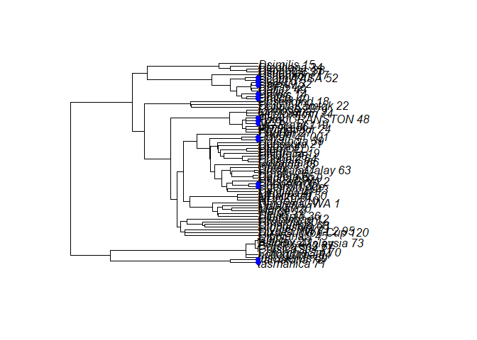

For the NJ tree:

``` r
plot(NJ_endosymbiont_tree)
```

    ## Warning in plot.phylo(NJ_endosymbiont_tree): 1 branch length(s) NA(s): branch
    ## lengths ignored in the plot

``` r
nodelabels(node=node_label_vec_NJ_numbers,pch=19,col="blue1")
```

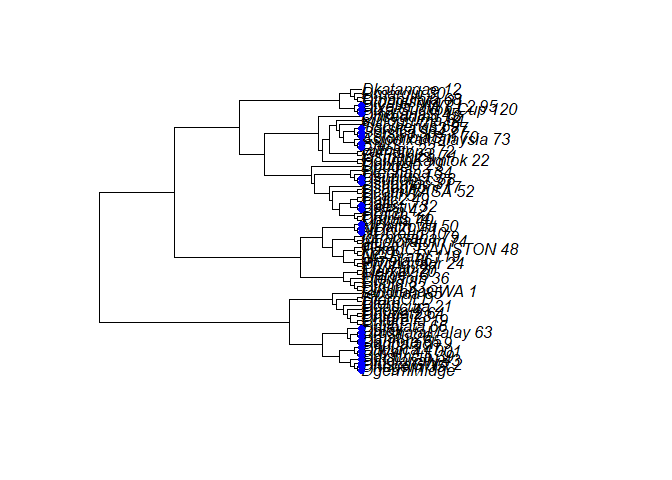

According to our plots, the NJ tree has a higher number of tips which
share a clade with the host tree. While the structure of these clades is
fundamentally different between the host and endosymbiont trees, we can
infer that the NJ endosymbiont tree shares larger clades with the host
tree than the UPGMA tree.

Is the number of tips of shared clades between the host and endosymbiont
trees the same as randomly generated trees? We’ll use another
permutaitonal hypothesis test (H0: they aren’t any different) to answer
this question.

Use a for loop to generate all the random trees and gather the number of
shared clades shared with the dixid tree. I’m choosing only to test
using `rcoal()` to make this assignment legible.

``` r
temp_tree_length_no<-as.vector(NULL)
for (i in 1:10000){
  temp_tree<-rcoal(n=length(dixid_tip_label_names),rooted=TRUE,tip.label=dixid_tip_label_names)
  temp_tree_clades <- simplify2array(lapply(GetTerminalDescendants(temp_tree), ConvertTipVectorToString))
  temp_tree_shared_clades<- which(temp_tree_clades %in% tree_clades)
  temp_shared_clades_pair<-(temp_tree_clades[temp_tree_shared_clades])
  node_label_vec_temp<-as.vector(NULL)
  for (j in 2:length(temp_shared_clades_pair)){
    
    temp_clade_vec<-as.numeric(unlist(strsplit(temp_shared_clades_pair[j],"_")))
    temp_node_labels<-as.vector(NULL)
    temp_node_labels_temp<-as.vector(NULL)
    
    for (k in 1:length(temp_clade_vec)){
      
      temp_node_labels_temp<-attr(((Descendants(temp_tree))),"labels")[temp_clade_vec[1]]
      temp_node_labels_new<-as.vector(NULL)
      for (m in 1:length(temp_node_labels_temp)){
        if (temp_node_labels_temp[m]!="NA"){
          temp_node_labels_new<-temp_node_labels_temp[m]
        }
      }
      temp_node_labels<-paste(temp_node_labels_new,collapse="_")
      
    }
    node_label_vec_temp<-append(node_label_vec_temp,temp_node_labels,after=1)
  }
  node_label_vec_temp_numbers<-as.vector(NULL)
  for (h in 1:length(temp_shared_clades_pair)){
    
    temp_clade_vec<-as.numeric(unlist(strsplit(temp_shared_clades_pair[i],"_")))
    node_label_vec_temp_numbers<-append(node_label_vec_temp_numbers,temp_clade_vec,after=1)
  }
  temp_tree_length_no[i]<-length(node_label_vec_temp_numbers)
}
```

Deleting the first two values because this loop appears to have a short
burn-in for the first two steps where all values produced are outliers.

``` r
temp_tree_length_no<-temp_tree_length_no[-c(1:2)]

plot(density(temp_tree_length_no),xlab="Number of tips within a shared clade",main="")
clade_sd<-sd(temp_tree_length_no)
abline(v=(mean(temp_tree_length_no))-2*clade_sd,lwd=2,lty=2)
abline(v=(mean(temp_tree_length_no))+2*clade_sd,lwd=2,lty=2)
abline(v=(mean(temp_tree_length_no))-3*clade_sd,lwd=1,lty=2)
abline(v=(mean(temp_tree_length_no))+3*clade_sd,lwd=1,lty=2)

abline(v=length(unique(node_label_vec_UPGMA_numbers)),lwd=3,col="blue")
```

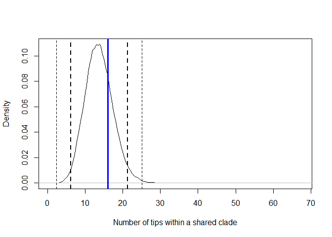

According to this test, we cannot reject the null hypothesis. The number
of tips shared between the UPGMA and host tree is not significantly
different than the number of tips shared between randomly-generated
trees and the host trees.

``` r
plot(density(temp_tree_length_no),xlab="Number of tips within a shared clade",main="")
clade_sd<-sd(temp_tree_length_no)
abline(v=(mean(temp_tree_length_no))-2*clade_sd,lwd=2,lty=2)
abline(v=(mean(temp_tree_length_no))+2*clade_sd,lwd=2,lty=2)
abline(v=(mean(temp_tree_length_no))-3*clade_sd,lwd=1,lty=2)
abline(v=(mean(temp_tree_length_no))+3*clade_sd,lwd=1,lty=2)

abline(v=length(unique(node_label_vec_NJ_numbers)),lwd=3,col="blue")
```

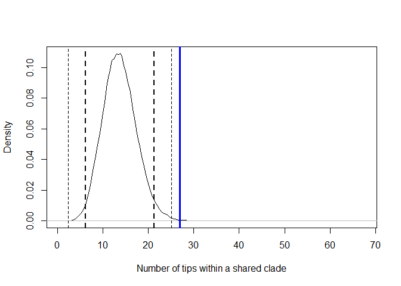

According to this test, we can reject the null hypothesis. The number of
tips shared between the NJ and host tree is significantly larger than
the number of tips shared between randomly-generated trees and the host
trees at a threshold of p\<0.01.

## Discussion and Future Directions

The tests performed in this exercise measure the similarity between host
and two endosymbiont trees, with the NJ tree being somewhat more similar
to the host tree than the UPGMA tree. As of now (5/18/2022) I do not yet
have a host tree with the tip labels of the endosymbiont tree. Though, I
expect the results using an actual host tree to resemble those that were
generated in this exercise. Bacteria, Rickettsia included, are known to
demonstrate horizontal gene transfer. Not all taxa in the endosymbiont
trees have the same amount of data in these trees either, so these
endosymbiont trees as they are unlikely to be similar to the host tree
anyway. The relatively large number of tips within shared clades between
host and endosymbiont trees is strange – if I had to guess it has
something to do with the large loop used to generate the permutated
phylogenies.

Therefore, I plan to explore different methods of tree construction to
build better endosymbiont trees than the NJ and UPGMA trees I am
currently using for this exercise. I’ve been told analyses in the R
package parafitt would be useful anlyze host-parasite phylogenies, and
I’m sure there are even more analyses to explore as well.
